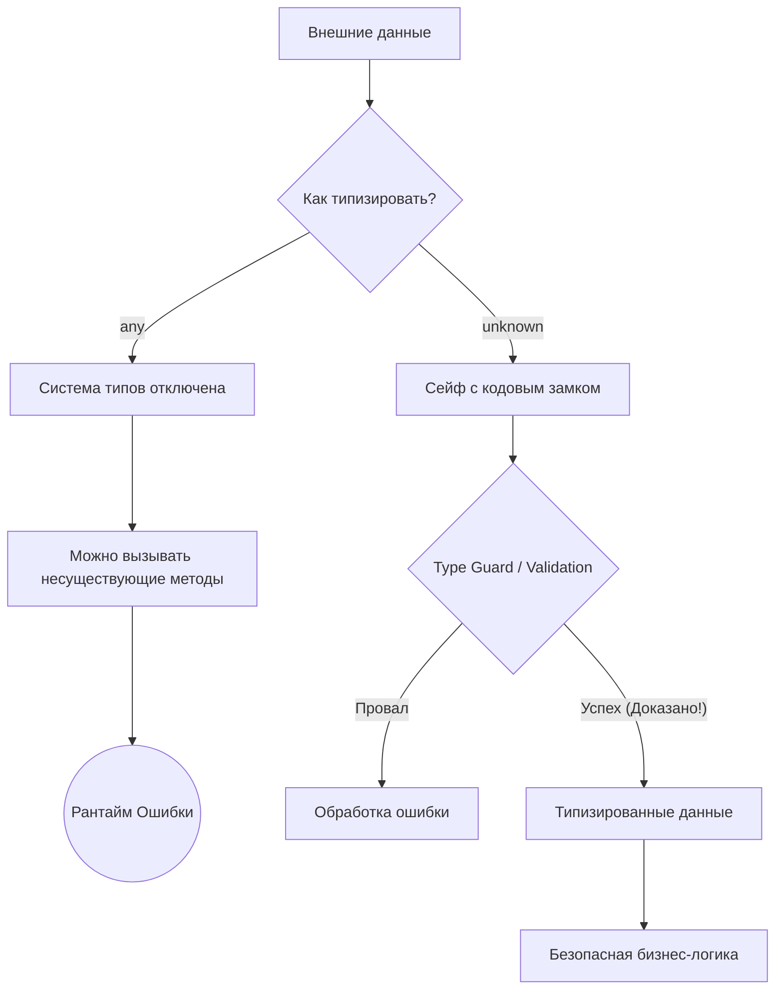

# unknown против any

## Суть концепции

В TypeScript и `any`, и `unknown` представляют собой типы, которые могут содержать абсолютно любое значение (Top Types). Однако архитектурно они являются полными противоположностями. 

`any` отключает систему типов. Это "черная дыра", которая поглощает проверки компилятора, позволяя вам вызывать любые методы и обращаться к любым свойствам, даже если их не существует. 
`unknown` — это типобезопасный аналог `any`. Он говорит: "Здесь может быть что угодно, поэтому я **запрещаю** тебе делать с этим что-либо, пока ты не докажешь мне (с помощью Type Guards), что это безопасно".

Отказ от `any` в пользу `unknown` решает проблему "расползания" нетипизированного кода. `any` заражает систему: если функция возвращает `any`, результат ломает проверки везде, где используется. `unknown` заставляет разработчика обрабатывать непредсказуемость данных на границе.

## Архитектурная схема



## Как это выглядит в коде

**Антипаттерн (Заражение через any):**
```typescript
// Мы берем данные и верим в чудо
function processEvent(event: any) {
  // TS молчит. В рантайме упадет, если event.payload = undefined
  event.payload.normalize(); 
}
```

**Как надо делать (Защита через unknown):**
```typescript
function processEvent(event: unknown) {
  // Ошибка компиляции! Object is of type 'unknown'.
  // event.payload.normalize(); 

  // Сначала нужно ДОКАЗАТЬ, что данные имеют нужную форму:
  if (
    typeof event === 'object' && 
    event !== null && 
    'payload' in event &&
    typeof (event as any).payload.normalize === 'function' // каст здесь только для глубокой проверки
  ) {
    // В реальной жизни тут используют Zod/Valibot, 
    // но суть остается: мы сузили unknown до известной структуры
    (event as { payload: { normalize: () => void } }).payload.normalize();
  }
}
```

## Неочевидные нюансы и границы применимости

1. **catch (error):** По умолчанию в старых версиях TS ошибка в блоке `catch(e)` имела тип `any`. Начиная с TS 4.4, добавлен флаг `useUnknownInCatchVariables` (включен в Strict Mode), который делает `e: unknown`. Это заставляет вас писать `if (e instanceof Error) console.log(e.message)`. Это часто бесит разработчиков, но архитектурно это правильно, так как в JS можно бросить не только `Error`, но и строку или `null`.
2. **Многословность (Boilerplate):** Использование `unknown` заставляет писать очень много проверок. Если вы повсеместно используете `unknown` без библиотек валидации (runtime validators), ваш код утонет в `if (typeof x === ...)`.
3. **any как крайняя мера:** `any` все еще имеет право на жизнь в очень редких архитектурных кейсах: например, при написании сверхсложных дженериков для вывода типов (conditional types), где TS просто не может справиться с `unknown`, или при временной миграции с JS на TS. Но в прикладном коде `any` — это всегда красный флаг.
