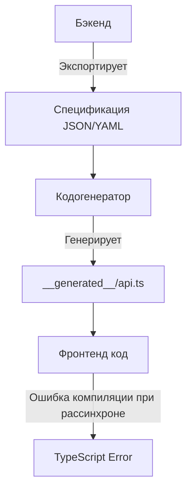

# API Type Generation

Генерация типов API — это мост между бэкендом и фронтендом, превращающий хрупкие договоренности в строгий автоматизированный контракт. 

## Какую боль решает?
Исторически фронтенд-разработчики вручную переписывали интерфейсы ответов бэкенда. Бэкенд переименовал `user_id` в `userId` — фронтенд падает в рантайме, потому что TypeScript не знал об изменениях. Ручная синхронизация неизбежно приводит к рассинхрону, опечаткам и "латанию дыр" с помощью `any` или `as`.

## Как это работает на практике
Контракт API (Swagger/OpenAPI, GraphQL Schema, gRPC Proto) выступает единым источником истины. В процессе сборки или на этапе CI запускается кодогенератор, который парсит спецификацию и выплевывает готовые `.ts` файлы с интерфейсами. Фронтенд импортирует эти типы, и любое изменение на бэкенде моментально подсвечивается компилятором как ошибка.



## Примеры

### Антипаттерн: Ручная типизация
Мы верим бэкенду на слово и дублируем работу.
```typescript
// ❌ Плохо: ручное дублирование, которое устареет завтра
interface User {
  id: string;
  name: string;
  role: "admin" | "user"; // Бэкенд добавил "manager", а мы не знаем
}

const fetchUser = async (): Promise<User> => {
  const res = await fetch('/api/users/1');
  return res.json(); 
};
```

### Как надо: Автогенерация
Мы используем сгенерированные типы, гарантируя актуальность.
```typescript
// ✅ Хорошо: тип импортируется из автосгенерированного файла
import { components } from './__generated__/schema';

type User = components['schemas']['User'];

const fetchUser = async (): Promise<User> => {
  const res = await fetch('/api/users/1');
  return res.json() as Promise<User>; 
};
```

## Неочевидные нюансы и трейд-оффы
1. **Мусор в спецификации:** Автогенерация безжалостно вскрывает все грехи бэкенд-разработчиков. Если в Swagger поля не помечены как `required`, в TypeScript *всё* станет опциональным (`?`). Придется заставлять бэкенд писать качественную спеку.
2. **Огромные файлы и производительность:** Сгенерированные файлы могут весить мегабайты. Это может замедлять работу IDE (TS Server). Имеет смысл генерировать типы модульно.
3. **Генерация рантайм-кода vs Типы:** Некоторые инструменты генерируют готовые классы или хуки (`axios` вызовы, `react-query` хуки). Это удобно, но увеличивает бандл и привязывает архитектуру к конкретному инструменту. Чище генерировать *только* типы (`openapi-typescript`).
4. **Конфликты при мерже:** Файлы `__generated__` часто вызывают конфликты в Git. Рекомендуется не коммитить их, а генерировать на хуке `postinstall` или перед билдом (хотя это замедляет сетап). Если коммитите — нужен строгий CI-check, что типы актуальны.
