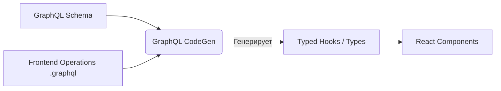

# GraphQL Code Generation

GraphQL предоставляет строгую типизацию из коробки, но GraphQL Code Generator выводит её на новый уровень, генерируя не только типы, но и готовые инструменты для работы с API прямо на клиенте.

## Какую боль решает?
Даже имея схему GraphQL, фронтендерам приходится вручную описывать типы ответов для каждого запроса (query/mutation). Это рутина. Кроме того, использование фрагментов (Fragments) усложняет типизацию: как убедиться, что компонент получает именно те поля, которые запросил, а не весь объект целиком?

## Как это работает на практике
Библиотека GraphQL Code Generator (или аналоги) анализирует два источника:
1. Базовую схему сервера (Schema).
2. Операции фронтенда (файлы `.graphql` или `gql` теги в коде).

На основе этого генерируются полностью типизированные хуки (например, для Apollo Client или Urql) и типы возвращаемых данных, которые точно соответствуют тому, что было запрошено.



## Примеры

### Антипаттерн: Ручная типизация ответа
```typescript
// ❌ Плохо: Типизация пишется вручную и может не совпадать с запросом
import { useQuery } from '@apollo/client';
import { GET_USER } from './queries';

interface GetUserResponse {
  user: {
    id: string;
    name: string;
  };
}

const UserProfile = () => {
  const { data } = useQuery<GetUserResponse>(GET_USER);
  return <div>{data?.user.name}</div>;
};
```

### Как надо: Сгенерированные хуки
```typescript
// ✅ Хорошо: Используем готовый хук, всё типизировано автоматически
import { useGetUserQuery } from './__generated__/graphql';

const UserProfile = () => {
  // data уже имеет нужный тип, основанный на самом запросе
  const { data } = useGetUserQuery({ variables: { id: "1" } });
  return <div>{data?.user?.name}</div>;
};
```

## Неочевидные нюансы и трейд-оффы
1. **Data Masking (Fragment Isolation):** Продвинутые фичи кодогенерации (например, пресет `client-preset`) скрывают данные фрагментов за непрозрачными типами. Это защищает компоненты от использования полей, которые они не запрашивали явно, но усложняет работу с моками в тестах (потребуются хелперы типа `makeFragmentData`).
2. **Время сборки:** На больших проектах с сотнями запросов кодогенерация может занимать ощутимое время. Решение — watch-режим (для разработки) и разбиение генерации по модулям.
3. **Засорение пространства имен:** Генерация множества типов (`User`, `UserQuery`, `UserFragment`) требует аккуратности в настройке префиксов и суффиксов, чтобы избежать путаницы при импортах.
