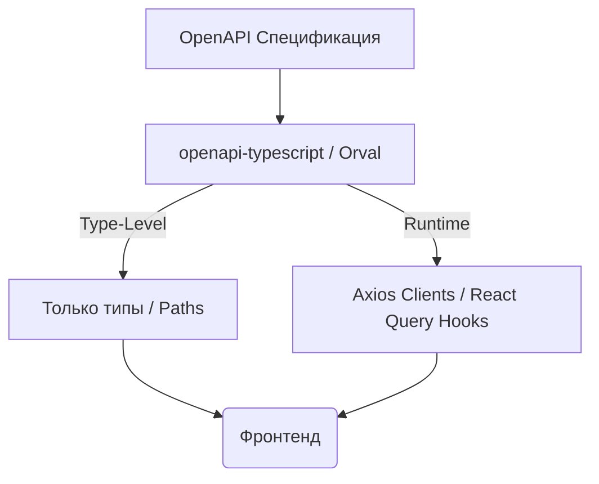

# OpenAPI Type Generation

OpenAPI (в прошлом Swagger) — это стандарт де-факто для описания REST API. Генерация типов из OpenAPI позволяет перенести опыт работы со строго типизированным контрактом из RPC/GraphQL в мир классического REST.

## Какую боль решает?
REST по своей природе не имеет встроенной типизации контрактов на уровне транспорта. Разработчикам приходится писать обертки на Axios/Fetch и руками декларировать интерфейсы для `Request`, `Response`, `Query` и `Path` параметров. Это долго, скучно и, главное, небезопасно — бэкенд обновит контракт, а фронтенд узнает об этом только от пользователей.

## Как это работает на практике
Используются инструменты вроде `openapi-typescript`, `Orval` или `Swagger UI Codegen`. Инструмент берет `openapi.yaml` (или `.json`) и генерирует древовидную структуру типов в TypeScript. Продвинутые генераторы (как `Orval`) могут сразу создавать готовые хуки для React Query (TanStack Query) или вызовы для Axios.



## Примеры

### Антипаттерн: Ручное приведение типов
```typescript
// ❌ Плохо: Использование `any` неявно или `as` касты
const updateProfile = async (data: any) => {
  const response = await axios.post<{ status: string }>('/api/profile', data);
  return response.data;
};
```

### Как надо: `openapi-typescript` + `openapi-fetch`
```typescript
// ✅ Хорошо: Вызов полностью выведен из OpenAPI-схемы
import createClient from "openapi-fetch";
import type { paths } from "./__generated__/schema";

const client = createClient<paths>({ baseUrl: "https://api.example.com" });

const updateProfile = async () => {
  // Автокомплит для пути, тела запроса и ответа
  const { data, error } = await client.POST("/api/profile", {
    body: {
      name: "John",
      age: 30
    }
  });
  
  if (data) console.log(data.status);
};
```

## Неочевидные нюансы и трейд-оффы
1. **Качество спеки — бутылочное горлышко:** В отличие от GraphQL, где плохую схему не пропустит компилятор, OpenAPI можно написать "спустя рукава". Если бэкенд возвращает `object` без описания свойств или забывает `required` поля, то сгенерированные типы будут бесполезны (`any` или `Record<string, unknown>`).
2. **Толстые клиенты (Runtime Bloat):** Генераторы, создающие рантайм-клиенты (Axios обертки), могут раздувать бандл, генерируя классы для сотен эндпоинтов, из которых используется десяток. Современный подход — генерировать *только типы* (`openapi-typescript`) и использовать легковесные type-safe клиенты (`openapi-fetch`).
3. **Версионирование API:** При генерации важно понимать, какую версию API мы берем. В идеале процесс получения схемы должен быть автоматизирован (через CI), а не сводиться к скачиванию файла руками.
