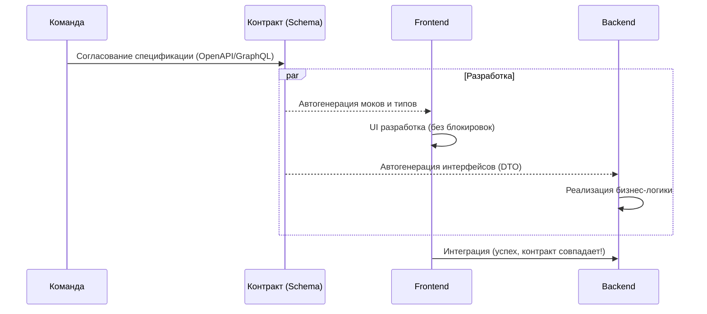

# Schema First Development

Schema First (Разработка от контракта) — это методология, при которой написание кода начинается только после того, как согласован и задокументирован API контракт (схема).

## Какую боль решает?
Классическая проблема "курицы и яйца": фронтенд не может делать UI, потому что нет реального API, а бэкенд не знает, какие именно данные нужны интерфейсу. Это приводит к блокировкам в команде, а в конце спринта — к болезненной интеграции ("Фронтенд ожидал массив, а пришел объект").

## Как это работает на практике
1. Аналитики, фронтендеры и бэкендеры вместе проектируют схему (GraphQL Schema или OpenAPI YAML).
2. Схема фиксируется в репозитории.
3. На основе схемы поднимаются **Mock-серверы** (например, Prism для OpenAPI или GraphQL Faker).
4. Фронтенд генерирует типы и разрабатывает фичи на моках.
5. Бэкенд реализует логику, покрывая её тестами на соответствие этой же схеме.
6. Интеграция проходит бесшовно, так как обе стороны соблюли контракт.



## Примеры

### Антипаттерн: Code First
Сначала пишем код, потом из него как-то генерируется спека (часто с "костылями" и `any`). Фронтенд ждет деплоя бэкенда на `dev` стенд.
```typescript
// ❌ Плохо: Фронтендер хардкодит моки руками, пока бэкенд пишет код
const mockUser = { name: "Test" }; // А бэкенд в итоге сделает { firstName: "Test" }
```

### Как надо: Schema First + MSW
Контракт описан, фронтенд использует моки, сгенерированные из схемы, или пишет перехватчики строго по типам схемы.
```typescript
// ✅ Хорошо: Фронтенд использует Mock Service Worker (MSW) с типами из контракта
import { rest } from 'msw';
import { components } from './__generated__/schema';

type UserResponse = components['schemas']['User'];

export const handlers = [
  rest.get('/api/user', (req, res, ctx) => {
    // TypeScript проверит, что мок соответствует реальной схеме бэкенда!
    return res(ctx.json<UserResponse>({ id: '1', name: 'John Doe' }));
  }),
];
```

## Неочевидные нюансы и трейд-оффы
1. **Бюрократия на старте:** Проектирование схемы требует времени. Разработка "физически" начинается позже, хотя заканчивается быстрее и предсказуемее.
2. **Изменение требований:** Если в процессе понимается, что поле нужно назвать иначе, процесс требует изменения контракта, перегенерации типов и обновления моков. Это добавляет трения, но спасает от багов.
3. **Ответственность:** Схема должна быть единым источником истины. Если кто-то нарушает контракт в рантайме, виноват тот, кто не соответствует схеме. Обычно контракт хранится в отдельном репозитории или папке с жестким ревью от обеих команд.
