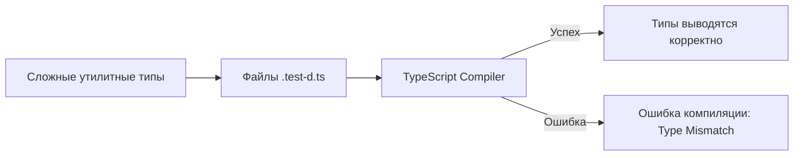

# Type Level Tests

Type Level Tests (тестирование на уровне типов) — это практика написания автоматизированных тестов для проверки поведения самой системы типов TypeScript, без выполнения кода в рантайме.

## Какую боль решает?
В современных фронтенд-архитектурах часто появляются сложные утилитные типы (Generics, Conditional Types, Mapped Types) — например, для типизации API-ответов, стейт-менеджеров или дизайн-систем. Изменение в таких типах может сломать вывод типов (Type Inference) в сотнях файлов. Обычные юнит-тесты это не отловят (так как после компиляции типов не остается), а ручная проверка слишком ненадежна.

## Как это работает на практике
Используются специальные библиотеки-хелперы (например, `tsd`, `expect-type` или просто самописные утилиты типа `Expect<Equal<A, B>>`). Вы пишете обычные файлы (часто `.test-d.ts`), где вызываете функции или объявляете переменные, оборачивая их в проверки. Компилятор TypeScript (или утилита `tsd`) проверяет эти файлы. Если тип вывелся неправильно, компилятор бросает ошибку.



## Примеры

### Антипаттерн: "Просто поверить" TS
Сложный тип написан, но его краевые случаи не задокументированы в виде проверок. При рефакторинге тип ломается и откатывается к `any` или `never`.
```typescript
// ❌ Плохо: Надеемся, что эта магия всегда работает
type ExtractData<T> = T extends { data: infer D } ? D : never;
```

### Как надо: Type-Level Testing
Используем библиотеку `expect-type` для фиксации поведения.
```typescript
// ✅ Хорошо: Тестируем вывод типов
import { expectTypeOf } from 'expect-type';

type ExtractData<T> = T extends { data: infer D } ? D : never;

// Тесты не выполняются в браузере или Node.js, они нужны только компилятору
expectTypeOf<ExtractData<{ data: string }>>().toEqualTypeOf<string>();
expectTypeOf<ExtractData<{ data: number }>>().toEqualTypeOf<number>();
expectTypeOf<ExtractData<{ error: string }>>().toBeNever();
```

## Неочевидные нюансы и трейд-оффы
1. **Для кого это нужно:** Type Level Tests обязательны для авторов библиотек (как Redux Toolkit, React Query) и разработчиков Core-команд. Для обычной продуктовой логики (UI компонентов) это оверкилл.
2. **"Ложные друзья" TypeScript:** Сравнение типов в TS (то самое `Equal`) — невероятно сложная математическая задача. Например, `any` может пройти тест как `string`. Иногда приходится использовать глубоко скрытые хаки TypeScript для точной проверки эквивалентности типов (строгое `Equal<X, Y>`).
3. **Скорость компиляции:** Большое количество type-level тестов с тяжелыми дженериками может серьезно замедлить проверку типов (`tsc --noEmit`). Их принято выносить в отдельный `tsconfig.json` и гонять отдельной джобой в CI.
