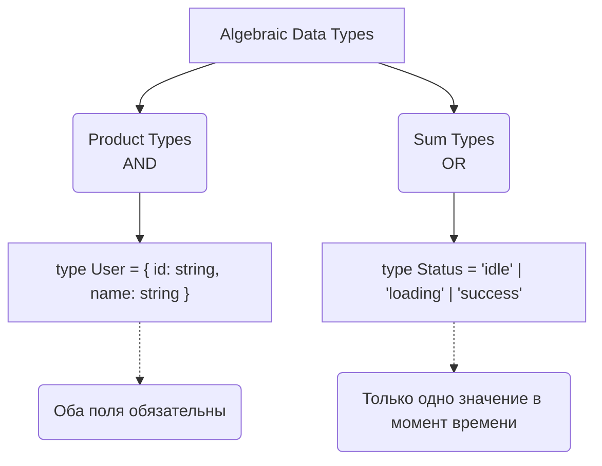

# Algebraic Data Types (ADT)

## История и суть

Алгебраические типы данных (ADT) — это математический подход к конструированию типов. В мире фронтенда и TypeScript мы часто сталкиваемся с тем, что состояние компонента или приложения описывается множеством независимых флагов (`isLoading`, `hasError`, `data`). Это приводит к "нелегальным состояниям" (например, одновременно `isLoading: true` и `hasError: true`). 

ADT решает эту проблему, предлагая строить модели предметной области с помощью двух операций:
1. **Product types (Типы-произведения)**: объединение (AND). Например, объекты и кортежи.
2. **Sum types (Типы-суммы)**: альтернативы (OR). В TypeScript это Union типы (`|`).

Используя ADT, мы делаем так, что невалидные состояния становятся невозможными на этапе компиляции.

## Визуализация



## Примеры кода

### ❌ Анти-паттерн: Флаги состояний

```typescript
// Множество комбинаций, некоторые из которых бессмысленны
interface UserState {
  isLoading: boolean;
  error: string | null;
  user: User | null;
}

// Возможен баг:
const badState: UserState = { isLoading: true, error: "Network Error", user: { name: "Alice" } };
```

### ✅ Как надо: Использование Sum-типов

```typescript
type UserState = 
  | { status: 'idle' }
  | { status: 'loading' }
  | { status: 'error'; error: string }
  | { status: 'success'; user: User };

// Компилятор не даст создать невалидное состояние:
const goodState: UserState = { status: 'loading' }; 
// Нельзя добавить error, пока status !== 'error'
```

## Неочевидные нюансы и границы применимости

- **Сложность маппинга API**: Серверные API часто возвращают плоские объекты с опциональными полями. Преобразование таких ответов в строгие ADT на клиенте требует написания слоев маппинга (парсеров), что добавляет бойлерплейта.
- **Производительность компилятора**: Очень большие и сложные Union-типы могут замедлять работу TypeScript-сервера (tsc).
- **Многословность (Verbosity)**: Функциональный подход к типам иногда заставляет писать больше кода для "распаковки" значений (паттерн-матчинг).
- **Где ломается**: При необходимости сериализации/десериализации сложных древовидных структур ADT в JSON, так как JSON не сохраняет типы и метаданные "тегов".
