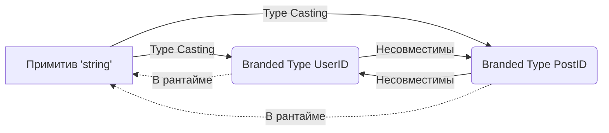

# Branded Types

## История и суть

TypeScript использует структурную типизацию (duck typing): если два типа имеют одинаковую структуру, они считаются совместимыми. Однако в бизнес-логике `UserID` и `PostID` — это концептуально разные вещи, даже если под капотом они оба являются обычными строками (`string`).

Если мы опишем их просто как `type UserID = string`, мы рискуем случайно передать ID поста в функцию, ожидающую ID пользователя. 

**Branded Types** (или Opaque Types) — это трюк в TypeScript для эмуляции номинальной типизации. Мы "клеймим" базовый тип уникальным маркером, делая его уникальным для компилятора, при этом в рантайме это остается обычным примитивом (никакого оверхеда).

## Визуализация



## Примеры кода

### ❌ Анти-паттерн: Примитивная одержимость

```typescript
type UserId = string;
type PostId = string;

function deleteUser(id: UserId) { /* ... */ }

const postId: PostId = "post-123";
// TS пропустит эту ошибку, так как типы структурно идентичны
deleteUser(postId); 
```

### ✅ Как надо: Branded Types

```typescript
// Вспомогательный тип для клеймения
declare const __brand: unique symbol;
export type Brand<K, T> = K & { [__brand]: T };

export type UserId = Brand<string, 'UserId'>;
export type PostId = Brand<string, 'PostId'>;

function deleteUser(id: UserId) { /* ... */ }

// Фабрики для создания типизированных ID
const makeUserId = (id: string) => id as UserId;
const makePostId = (id: string) => id as PostId;

const myPostId = makePostId("post-123");

// ОШИБКА КОМПИЛЯТОРА! То, что мы и хотели.
// Argument of type 'PostId' is not assignable to parameter of type 'UserId'.
deleteUser(myPostId); 
```

## Неочевидные нюансы и границы применимости

- **Runtime стирание**: В рантайме поле `[__brand]` не существует. Это чистая магия компилятора. Если данные приходят снаружи (из API), их нужно явно кастить (или валидировать через Zod/io-ts).
- **Протекание абстракции**: Из-за того, что тип все еще является строкой под капотом, вы можете вызывать строковые методы `myUserId.toLowerCase()`, что вернет обычный `string`, потеряв "клеймо".
- **Где применимо**: Идентификаторы, строгие форматы строк (Email, URL), валюты.
- **Оверхед на разработку**: Везде придется использовать кастинг `as UserId` при инициализации. Это утомляет, если доменных примитивов становится слишком много.
