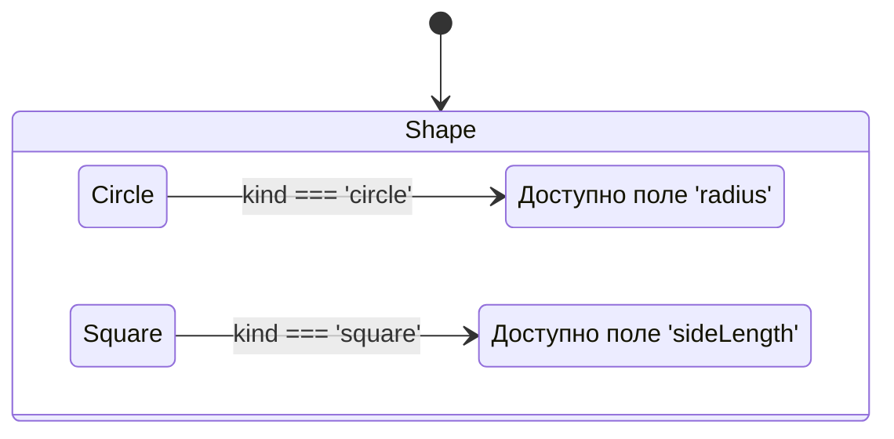

# Discriminated Unions

## История и суть

При моделировании сложных объектов предметной области нам часто нужно описать сущность, которая может находиться в одном из нескольких взаимоисключающих состояний. 

**Discriminated Unions** (Размеченные объединения или Tagged Unions) — это паттерн в TypeScript, где каждый тип в объединении (`Union`) имеет общее поле (дискриминант или тег) с уникальным литеральным типом.

Когда мы проверяем значение этого тега с помощью `switch` или `if`, TypeScript автоматически "сужает" (narrows) тип объекта до конкретного интерфейса. Это позволяет безопасно обращаться к полям, которые существуют только в этом специфичном состоянии.

## Визуализация



## Примеры кода

### ❌ Анти-паттерн: Необязательные поля для всех случаев

```typescript
interface Payment {
  method: string; // 'card' | 'paypal' | 'cash'
  cardNumber?: string;
  paypalEmail?: string;
}

function processPayment(payment: Payment) {
  if (payment.method === 'card') {
    // Приходится использовать '!', так как TS не знает, что поле точно есть
    console.log(payment.cardNumber!.slice(-4));
  }
}
```

### ✅ Как надо: Discriminated Union

```typescript
type Payment = 
  | { method: 'card'; cardNumber: string }
  | { method: 'paypal'; email: string }
  | { method: 'cash' };

function processPayment(payment: Payment) {
  // Дискриминант: поле 'method'
  switch (payment.method) {
    case 'card':
      // TS понимает, что здесь payment имеет тип card
      console.log(payment.cardNumber.slice(-4)); 
      break;
    case 'paypal':
      console.log(payment.email);
      break;
    case 'cash':
      // console.log(payment.email); // Ошибка TS!
      break;
  }
}
```

## Неочевидные нюансы и границы применимости

- **Ограничения дискриминанта**: Поле-тег должно быть литеральным типом (`string`, `number`, `boolean` или `enum`). Использовать сложные объекты или динамические ключи в качестве тега нельзя.
- **Масштабируемость**: При добавлении нового варианта в Union (например, `apple_pay`), все функции, использующие `switch`, должны быть обновлены. Это решается паттерном *Exhaustiveness Checking* (проверка на исчерпываемость).
- **Создание мусора в памяти (Garbage Collection)**: Если состояния часто сменяются, мы постоянно пересоздаем объекты с разными тегами. В критичных для производительности местах (например, WebGL/canvas рендер) это может вызвать фризы из-за работы GC.
- **Сериализация**: Поле дискриминанта (например, `type` или `kind`) должно реально существовать в JSON, чтобы рантайм мог его проанализировать. Если API не отдает такой тег, вам придется мапить данные на клиенте руками.
