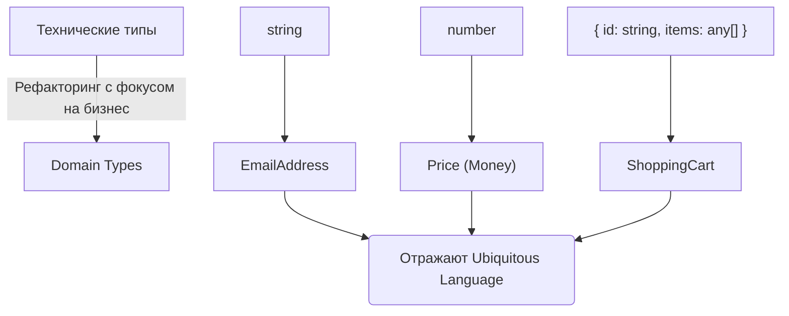

# Domain Types

## История и суть

**Domain Types** (Доменные типы) — это типы данных, которые описывают бизнес-правила и сущности приложения на языке самой предметной области (Ubiquitous Language из Domain-Driven Design). 

Вместо того чтобы оперировать техническими абстракциями (массивы, строки, JSON-объекты), мы создаем типы, которые несут семантический смысл: `Cart`, `Product`, `CustomerStatus`. 

Главная цель доменных типов в TypeScript — сделать так, чтобы бизнес-логика читалась как спецификация, а нарушение бизнес-правил приводило к ошибкам компиляции, а не рантайма.

## Визуализация



## Примеры кода

### ❌ Анти-паттерн: Утечка деталей реализации (Anemic Domain Model)

```typescript
// Техническое описание, оторванное от бизнеса
interface OrderDto {
  id: string;
  status: number; // Что значит 1 или 2?
  total: number;  // В какой валюте?
}

function process(order: OrderDto) {
  if (order.status === 1) { /* ... */ }
}
```

### ✅ Как надо: Выразительные Domain Types

```typescript
// Branded типы для идентификаторов и примитивов
type OrderId = string & { readonly __brand: unique symbol };
type USD = number & { readonly __brand: unique symbol };

// Доменные значения (Value Objects)
type OrderStatus = 'Draft' | 'Paid' | 'Shipped' | 'Cancelled';

// Богатая доменная модель
interface Order {
  readonly id: OrderId;
  readonly status: OrderStatus;
  readonly totalAmount: USD;
}

// Бизнес-правило в сигнатуре: мы можем отгрузить только оплаченный заказ
function shipOrder(order: Order & { status: 'Paid' }) {
  // ...
}
```

## Неочевидные нюансы и границы применимости

- **Синхронизация с бэкендом**: Если бэкенд возвращает `OrderDto`, нужен слой маппинга (Anti-Corruption Layer), который трансформирует DTO в чистые доменные типы клиента. Это двойная работа.
- **Оверхед на разработку**: В простых CRUD-приложениях введение сложных доменных типов — это *overengineering*. Если фронтенд просто перекладывает JSON из API в формочку, сложные доменные типы не окупятся.
- **Протекание бизнес-логики во View**: Важно не завязывать UI-компоненты напрямую на глубокие доменные типы. Компонентам часто нужны плоские UI-модели (ViewModels), иначе View становится слишком сложным и привязанным к бизнес-правилам.
