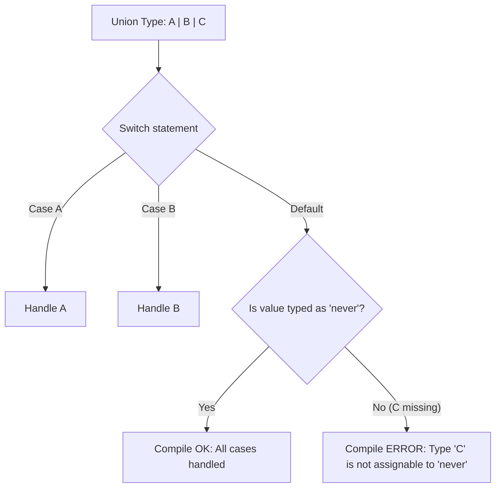

# Exhaustiveness Checking

## История и суть

Когда мы используем *Discriminated Unions*, мы перебираем возможные варианты с помощью `switch` или `if/else`. Проблема возникает при развитии приложения: разработчик добавляет новое состояние в объединение (например, новый метод оплаты), но забывает обновить все конструкции `switch` по всей кодовой базе. В рантайме это может привести к тихому багу или падению приложения.

**Exhaustiveness Checking** (проверка на исчерпываемость) — это архитектурный паттерн, использующий тип `never` в TypeScript для гарантии того, что мы обработали абсолютно все ветвления. Если мы забудем кейс, компилятор выдаст ошибку.

## Визуализация



## Примеры кода

### ❌ Анти-паттерн: Тихие баги при добавлении типа

```typescript
type Notification = 
  | { type: 'email'; address: string }
  | { type: 'sms'; phone: string }
  | { type: 'push'; deviceToken: string }; // Добавили push, но забыли обновить функцию

function sendNotification(n: Notification) {
  switch (n.type) {
    case 'email': /* send email */ break;
    case 'sms': /* send sms */ break;
    // Ошибки нет, 'push' просто игнорируется в рантайме!
  }
}
```

### ✅ Как надо: Использование assertUnreachable

```typescript
// Хелпер, который принимает только тип never
function assertUnreachable(x: never): never {
  throw new Error("Didn't expect to get here");
}

function sendNotificationSafe(n: Notification) {
  switch (n.type) {
    case 'email': /* send email */ break;
    case 'sms': /* send sms */ break;
    default:
      // ОШИБКА КОМПИЛЯЦИИ: 
      // Argument of type '{ type: "push"; deviceToken: string; }' is not assignable to parameter of type 'never'.
      assertUnreachable(n);
  }
}
```

## Неочевидные нюансы и границы применимости

- **Недопустимость `any`**: Если в цепочке данных тип случайно деградирует до `any` (например, пришел из API без валидации), то паттерн ломается, так как `any` можно передать в `never`.
- **tsconfig.json**: Для более строгой проверки без вспомогательной функции можно использовать флаг `"noImplicitReturns": true` и `return` в каждом `case`. Однако `assertUnreachable` лучше тем, что явно показывает намерение разработчика и защищает в рантайме (кидает ошибку, если данные пришли в обход типизации, например, из JavaScript-кода).
- **Избыточность в библиотеках**: Если вы пишите открытую библиотеку, пользователи которой не обязаны использовать TypeScript, одного `never` мало. Необходимо оставлять рантайм-броски исключений в `default` блоках.
