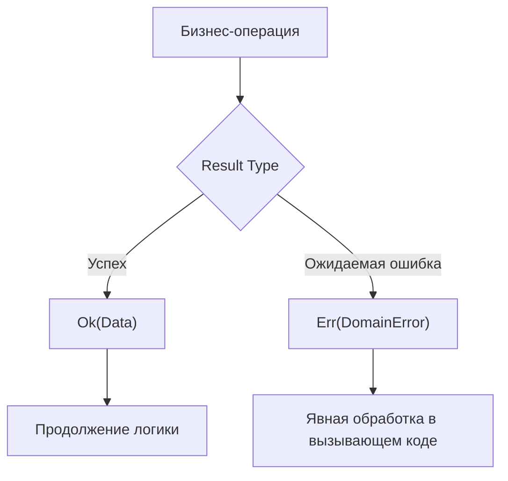

# Result Type

## История и суть

В классическом JavaScript ошибки обрабатываются через выброс исключений: `throw new Error()`. Проблема `try/catch` в том, что он нарушает поток управления (control flow). Хуже того, сигнатуры функций в TypeScript не показывают, какие ошибки функция может выбросить (в отличие от Java). Вызов функции — это "русская рулетка": упадет или нет?

**Result Type** (известный как Either в функциональном программировании) решает эту проблему. Это тип-сумма, представляющий результат операции, которая может завершиться успешно (`Ok`) или с ожидаемой ошибкой (`Err`).

Используя `Result`, мы делаем ошибки частью возвращаемого значения. Система типов заставит разработчика явно обработать ошибку.

## Визуализация



## Примеры кода

### ❌ Анти-паттерн: Неявные исключения (try/catch)

```typescript
function parseJSON(data: string): object {
  return JSON.parse(data); // Может бросить SyntaxError!
}

// Вызывающий код не знает, что нужно оборачивать в try/catch
const obj = parseJSON('{"bad_json"'); 
// Приложение падает в рантайме.
```

### ✅ Как надо: Явный контракт через Result

```typescript
type Ok<T> = { readonly ok: true; readonly value: T };
type Err<E> = { readonly ok: false; readonly error: E };
type Result<T, E> = Ok<T> | Err<E>;

const ok = <T>(value: T): Ok<T> => ({ ok: true, value });
const err = <E>(error: E): Err<E> => ({ ok: false, error });

type ParseError = { type: 'ParseError', message: string };

function safeParse(data: string): Result<object, ParseError> {
  try {
    return ok(JSON.parse(data));
  } catch (e: any) {
    return err({ type: 'ParseError', message: e.message });
  }
}

const result = safeParse('{"bad_json"');

// Компилятор не даст обратиться к value, пока не проверим ok
if (!result.ok) {
  console.error("Failed:", result.error.message);
} else {
  console.log("Success:", result.value);
}
```

## Неочевидные нюансы и границы применимости

- **Только для ожидаемых ошибок (Expected Errors)**: Result следует использовать для бизнес-ошибок (неверный пароль, недостаточно средств). Фатальные и неожидаемые системные сбои (Out of Memory, потеря коннекта к БД) по-прежнему лучше бросать через `throw`, так как приложение всё равно не сможет их корректно обработать.
- **Инвазивность паттерна**: Если вы начали использовать Result на нижнем уровне архитектуры, он неизбежно "заразит" (распространится на) все вышестоящие уровни. Код будет изобиловать проверками `if (!result.ok)`.
- **Альтернативы в TS**: Иногда вместо тяжеловесного объекта Result используют простой Union: `type Response = Data | Error`. Но полноценный `Result` удобнее, если вы используете функциональные пайплайны.
- **Поддержка асинхронности**: Приходится работать с `Promise<Result<T, E>>`, что усложняет чтение кода без вспомогательных утилит.
