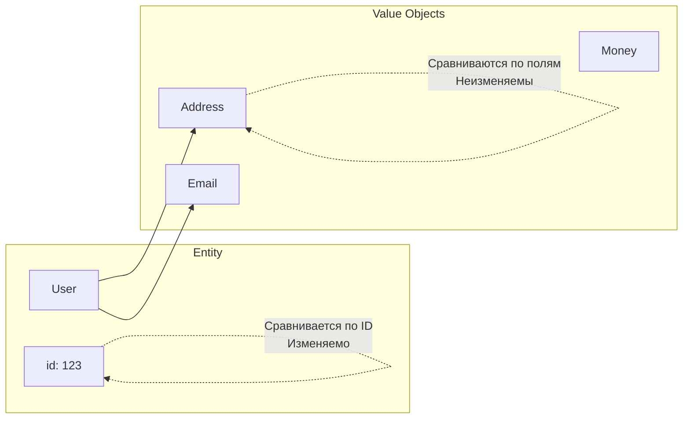

# Value Objects

## История и суть

В предметно-ориентированном проектировании (DDD) есть четкое разделение между Entity (Сущностями) и **Value Objects** (Объектами-значениями). 

Сущности имеют уникальную идентичность (ID): пользователь Иван остается Иваном, даже если сменит фамилию. 
Value Objects не имеют ID. Они определяются исключительно набором своих атрибутов. Если два Value Objects имеют одинаковые свойства, они считаются абсолютно равными. Пример: цвет (RGB), координаты (X,Y), деньги (Сумма + Валюта).

Главные правила Value Object в TypeScript:
1. **Иммутабельность**: их нельзя изменять после создания. Любая операция создает новый объект.
2. **Структурное равенство**: они должны иметь метод для сравнения по значению (или сравниваться структурно).
3. **Самовалидация**: нельзя создать невалидный Value Object.

## Визуализация



## Примеры кода

### ❌ Анти-паттерн: Разрозненные примитивы и мутации

```typescript
let amount = 100;
let currency = 'USD';

// Легко нарушить инвариант, обновив одно без другого
amount = 200; 
// currency остался старым. Логика сломана.
```

### ✅ Как надо: Класс Value Object

```typescript
class Money {
  // 1. Иммутабельность
  constructor(
    public readonly amount: number,
    public readonly currency: string
  ) {
    // 3. Самовалидация
    if (amount < 0) throw new Error("Amount cannot be negative");
  }

  // 2. Логика внутри объекта (возвращает новый инстанс)
  add(other: Money): Money {
    if (this.currency !== other.currency) {
      throw new Error("Cannot add different currencies");
    }
    return new Money(this.amount + other.amount, this.currency);
  }

  // Структурное равенство
  equals(other: Money): boolean {
    return this.amount === other.amount && this.currency === other.currency;
  }
}

const price1 = new Money(100, 'USD');
const price2 = new Money(100, 'USD');

console.log(price1 === price2); // false (ссылки разные)
console.log(price1.equals(price2)); // true (значения равны)
```

## Неочевидные нюансы и границы применимости

- **Классы vs Объекты**: В функциональном TypeScript (вместо классов с методами `equals`) часто используют простые `readonly` интерфейсы и чистые функции для операций (`addMoney(m1, m2)`). Это лучше дружит с сериализацией (например, в Redux нельзя хранить классы).
- **Сложность сериализации**: Если использовать классы для Value Objects, при получении данных с бэкенда или из LocalStorage их нужно десериализовывать (восстанавливать инстансы классов) через мапперы.
- **Оверхед на память**: При частых операциях иммутабельность означает постоянное создание новых объектов, что напрягает Garbage Collector.
- **Защита от изменений**: Чтобы сырые объекты в TS были настоящими Value Objects, недостаточно ключевого слова `readonly`. Глубоко вложенные массивы или объекты могут быть мутированы. В строгих проектах используют библиотеки вроде `immer` или глубокие Readonly-утилиты.
