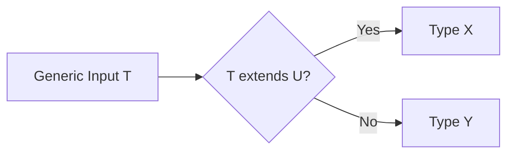

# Conditional Types (Условные типы)

## Концепция и проблематика
Представьте, что вы пишете API-клиент. Если вы передаете в функцию эндпоинт `/users`, она должна вернуть массив `User[]`. Если `/orders` — `Order[]`. Без условных типов вам пришлось бы писать десятки перегрузок функции или использовать `any`/`unknown`, заставляя разработчиков вручную кастовать типы через `as`. Условные типы решают эту боль, привнося логику ветвления (`if-else`) прямо на уровень типов: они позволяют типу адаптироваться в зависимости от входных параметров.

## Как это работает


## Примеры

**Антипаттерн:** Ручные перегрузки или потеря типизации
```typescript
declare function fetch(url: "/users"): User[];
declare function fetch(url: "/orders"): Order[];
// Слишком много дублирования!
```

**Как надо:** Условные типы
```typescript
type FetchResult<T> = T extends "/users" ? User[] :
                      T extends "/orders" ? Order[] :
                      never;

declare function fetch<T extends string>(url: T): FetchResult<T>;

const users = fetch("/users"); // Тип: User[]
```

## Неочевидные нюансы
- **Дистрибутивность (Distributive Conditional Types):** Если вы передаете union-тип в условный тип `T extends U`, TypeScript проверяет каждый элемент union-а по отдельности (`(A | B) extends U` превращается в `(A extends U) | (B extends U)`). Это может привести к неожиданным результатам, если вы хотели проверить весь union целиком. Чтобы отключить дистрибутивность, нужно обернуть типы в кортеж: `[T] extends [U]`.
- **`infer`:** Условные типы позволяют "вытаскивать" внутренние типы с помощью ключевого слова `infer`. Например, `T extends Array<infer U> ? U : T` достанет тип элемента из массива.
- **Накладные расходы:** Сложные, глубоко вложенные условные типы сильно замедляют компиляцию TypeScript (Type instantiation is excessively deep and possibly infinite).
