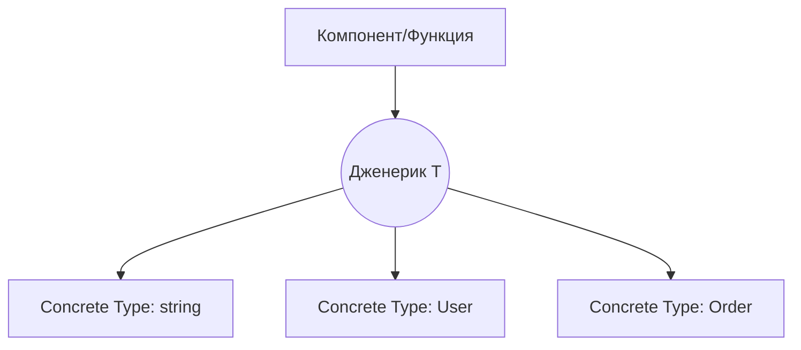

# Generics (Дженерики)

## Концепция и проблематика
Разработка требует переиспользуемых компонентов. Если мы создаем класс-контейнер `Box` или функцию для сортировки массивов, мы не хотим писать отдельные реализации для строк, чисел и пользовательских объектов. До появления дженериков приходилось использовать `any`, что полностью убивало типобезопасность. Дженерики — это «переменные для типов». Они позволяют написать код один раз и строго типизировать его для любых данных, которые в него передадут.

## Как это работает


## Примеры

**Антипаттерн:** Использование `any` (полная потеря контроля)
```typescript
function getFirstElement(arr: any[]): any {
  return arr[0];
}
const x = getFirstElement([1, 2, 3]); // Тип: any ❌
```

**Как надо:** Использование дженерика
```typescript
function getFirstElement<T>(arr: T[]): T {
  return arr[0];
}
const x = getFirstElement([1, 2, 3]); // Тип: number ✅
```

## Неочевидные нюансы
- **Type Erasure (Стирание типов):** Дженерики существуют только на этапе компиляции. В скомпилированном JavaScript их нет. Вы не можете сделать `if (myVar instanceof T)` во время выполнения программы.
- **Generic Constraints (Ограничения):** Дженерикам можно и нужно задавать границы с помощью `extends`. Например, `function printName<T extends { name: string }>(obj: T)`, чтобы гарантировать, что у объекта точно есть нужное поле.
- **Инференс типов (Type Inference):** В 90% случаев вам не нужно явно указывать тип `getFirstElement<number>([...])`, компилятор сам выведет (infer) тип по переданным аргументам. Но если аргументы пустые или неоднозначные, TypeScript может вывести тип `unknown` или ошибочный union.
