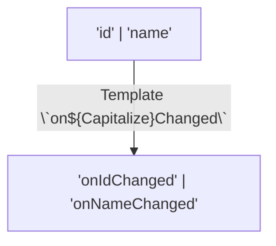

# Template Literal Types

## Концепция и проблематика
При разработке сложных UI-китов, роутеров или стейт-менеджеров часто возникает потребность жестко типизировать строковые значения, которые зависят от других типов. Например, если у нас есть события, они могут называться по шаблону `on[EventName]`. Раньше приходилось писать огромные union-типы вручную. Template Literal Types позволяют использовать синтаксис шаблонных строк (как в JS) прямо на уровне типов, генерируя новые строки из старых.

## Как это работает


## Примеры

**Антипаттерн:** Хардкод строковых union-ов
```typescript
type Events = "onIdChanged" | "onNameChanged" | "onAgeChanged";
// При добавлении нового поля придется обновлять Events руками.
```

**Как надо:** Шаблонные типы
```typescript
interface User { id: string; name: string; }

type ChangeEvent<T> = `on${Capitalize<string & keyof T>}Changed`;
type UserEvents = ChangeEvent<User>; 
// "onIdChanged" | "onNameChanged" ✅
```

## Неочевидные нюансы
- **Комбинаторный взрыв (Permutation Explosion):** Если вы используете несколько union-ов в одном шаблоне (например, ``type A = `${'a'|'b'}-${'c'|'d'}-${'e'|'f'}`;``), TypeScript генерирует все возможные комбинации (декартово произведение). Если комбинаций станет больше 100 000, компилятор просто упадет (Type instantiation is excessively deep).
- **Паттерн-матчинг:** Их можно комбинировать с `infer` для парсинга строк! Например: `type GetRouteParam<T> = T extends \`/user/${infer Param}\` ? Param : never;`. Это позволяет строго типизировать параметры путей (как в React Router или Next.js).
- **Разница между Compile-time и Runtime:** Шаблонные типы никак не влияют на реальный JS. Они не создадут и не модифицируют строку во время работы приложения.
