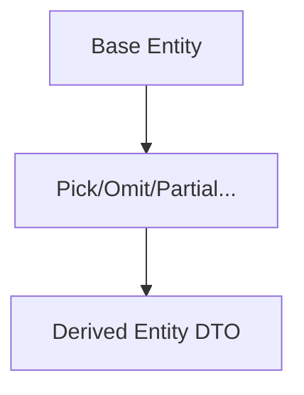

# Utility Types

## Концепция и проблематика
При работе с типами изо дня в день разработчики сталкиваются с одними и теми же задачами: "сделай все поля необязательными", "возьми только два поля из интерфейса", "исключи null", "получи тип возвращаемого значения функции". Чтобы не писать для этого `Mapped Types` или `Conditional Types` вручную, TypeScript предоставляет стандартную библиотеку типов — Utility Types. Это "швейцарский нож" архитектора.

## Как это работает


## Примеры

**Антипаттерн:** Ручное создание производных DTO
```typescript
interface User { id: number; name: string; email: string; }
interface UpdateUserDto { name?: string; email?: string; } 
// Дублирование, нет гарантии совпадения типов полей
```

**Как надо:** Использование Utility Types
```typescript
interface User { id: number; name: string; email: string; }

// Убираем id, остальные делаем опциональными
type UpdateUserDto = Partial<Omit<User, 'id'>>; 
```

## Основные утилиты и неочевидные нюансы
- **`Pick<T, K>` vs `Omit<T, K>`:** `Pick` оставляет указанные ключи, `Omit` удаляет. В старых версиях TS `Omit` не проверял, существует ли ключ `K` в интерфейсе `T` (вы могли сделать `Omit<User, 'nonExistent'>` без ошибки), но `Pick` строго требовал существования ключей.
- **`Record<K, T>`:** Создает объектный тип с ключами `K` и значениями `T`. Лучше использовать `Record<string, unknown>` вместо `object` или `any`.
- **`ReturnType<T>` / `Parameters<T>`:** Извлекают типы из функций. Очень полезно при работе с Redux или сторонними библиотеками, где функция не экспортирует тип своего возвращаемого значения.
- **`Awaited<T>`:** Позволяет "распаковать" промис, решая проблемы рекурсивных `Promise<Promise<T>>`.
- **Нюанс с `Partial` (Глубина):** `Partial` делает свойства опциональными только на *первом уровне*. Если у вас вложенный объект, он останется строго типизированным. Для глубокого применения приходится писать кастомный `DeepPartial<T>`.
