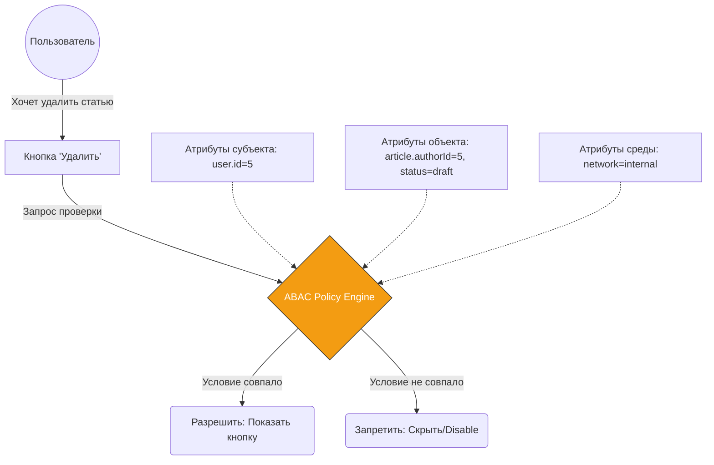

# Attribute-Based Access Control (ABAC)

## Суть и решаемая боль
В простых приложениях хватает RBAC (Role-Based Access Control) — у нас есть `admin` и `user`. Но что делать, когда бизнес-логика усложняется? "Пользователь может редактировать статью, ТОЛЬКО ЕСЛИ он её автор, статья в статусе 'черновик', и сейчас рабочее время". RBAC здесь ломается — нам пришлось бы создавать роль `draft_author_during_work_hours`, что приводит к взрыву ролей (Role Explosion). 

**ABAC** решает эту боль, вычисляя доступ динамически на основе **атрибутов**:
- **Subject** (Кто? Возраст, отдел, должность)
- **Object** (С чем? Статус документа, владелец)
- **Action** (Что делает? Read, write)
- **Environment** (В каких условиях? Время, IP-адрес, устройство)

## Как это работает на практике

На фронтенде ABAC сводится к вычислению булевых политик (Policies) перед рендерингом UI-элементов или переходом на роуты. Вместо жесткой проверки `if (user.role === 'admin')` мы передаем движку правил все известные атрибуты.



## Примеры кода

**Антипаттерн (Хардкод сложных условий в UI):**
```tsx
// Логика размазана по компонентам, легко ошибиться
const DeleteButton = ({ article, user }) => {
  const canDelete = user.role === 'admin' || 
                   (article.authorId === user.id && article.status === 'draft');
  
  if (!canDelete) return null;
  return <button>Удалить</button>;
}
```

**Правильное решение (Инкапсуляция политик):**
```tsx
// Политика вынесена в отдельный модуль
const canDeleteArticle = (user, article, context) => {
  if (user.role === 'admin') return true;
  if (article.authorId === user.id && article.status === 'draft') return true;
  return false;
};

// В компоненте только декларативная проверка
const DeleteButton = ({ article }) => {
  const { user } = useAuth();
  if (!canDeleteArticle(user, article)) return null;
  return <button>Удалить</button>;
}
```

## Неочевидные нюансы и границы применимости
- **Синхронизация стейта (Главная боль):** Фронтенд принимает решения на основе закэшированных данных. В момент нажатия на кнопку атрибуты объекта на бэкенде могли измениться (статус перешел из 'draft' в 'published'). Бэкенд всё равно **обязан** проверить ABAC-правила.
- **Оверхед на перфоманс:** Вычисление сложных политик в списках (например, для 100 элементов таблицы) может просадить FPS. Спасает мемоизация политик.
- **Когда не применять:** Если ваша система прав описывается ролями "админ / модератор / юзер" и не зависит от статусов сущностей — ABAC будет чудовищным оверхедом (Overengineering). Используйте RBAC.
