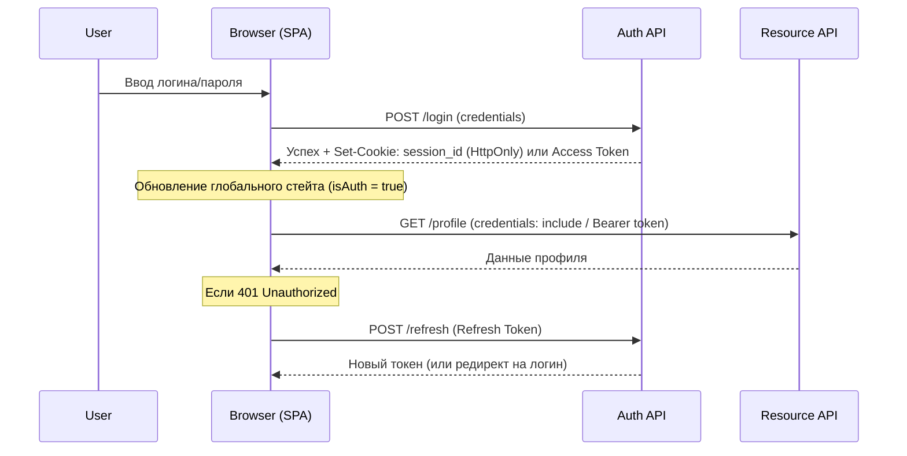

# Архитектура Аутентификации (Authentication Architecture)

## Суть и решаемая боль
Аутентификация (AuthN) — это ответ на вопрос «Кто ты такой?». В современных веб-приложениях это давно перестало быть простой связкой логин-пароль. Разработчики сталкиваются с болью сохранения состояния в stateless-протоколе HTTP (как не заставлять логиниться при каждом клике), обеспечения безопасности от кражи сессий, поддержкой SSO, OAuth, и мультиустройств. 

Архитектура аутентификации на фронтенде определяет, **как мы доказываем серверу свою личность, как храним этот факт локально и как бесшовно восстанавливаем сессию** при перезагрузке страницы, не жертвуя UX и безопасностью.

## Как это работает на практике

Глобально архитектура делится на два лагеря: **Stateful (Session-based)** и **Stateless (Token-based/JWT)**. На фронтенде мы управляем "состоянием входа" в глобальном стейте (Context/Redux) и перехватываем все сетевые запросы для подкладки кредов.



## Примеры кода

**Антипаттерн (Неконтролируемое состояние):**
```javascript
// Проверка авторизации зависит от наличия данных в localStorage
// Если пользователь руками добавит 'token: 123' в консоли, UI подумает, что он залогинен
const App = () => {
    const isAuth = !!localStorage.getItem('token');
    return isAuth ? <Dashboard /> : <Login />;
};
```

**Правильное решение (Single Source of Truth & Validation):**
```tsx
// Состояние авторизации проверяется бэкендом при инициализации приложения
const AuthProvider = ({ children }) => {
    const [user, setUser] = useState(null);
    const [loading, setLoading] = useState(true);

    useEffect(() => {
        api.get('/me')
           .then(({ data }) => setUser(data))
           .catch(() => setUser(null)) // 401 -> не залогинен
           .finally(() => setLoading(false));
    }, []);

    if (loading) return <SplashScreen />;
    return (
        <AuthContext.Provider value={{ user, setUser }}>
            {children}
        </AuthContext.Provider>
    );
};
```

## Неочевидные нюансы и трейдоффы
- **Проблема мигания (FOUC авторизации):** При первой загрузке SPA не знает, залогинен ли юзер (надо сходить за `/me`). Из-за этого может на секунду показаться форма логина, а потом дашборд. Решается правильными лоадерами (Splash screen) или SSR (в Next.js сессия проверяется до отдачи HTML).
- **Разлогин в соседней вкладке:** Если юзер открыл две вкладки, разлогинился в одной, вторая продолжит считать его залогиненным (если токен в памяти). Потребуется BroadcastChannel API или прослушивание события `storage` для синхронизации вкладок.
- **Оверхед на бэкенд:** При Session-based подходе бэкенд дергает базу/Redis на каждый запрос. Token-based (JWT) решает это, но ломает возможность моментального отзыва токена (revocation) до истечения его TTL.
