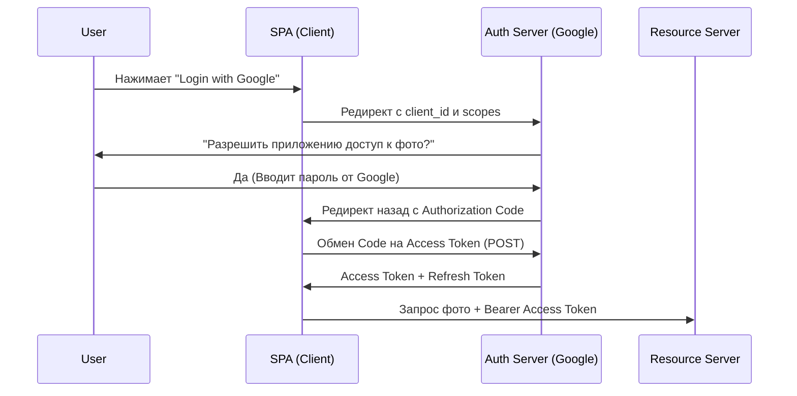

# OAuth 2.0 (Open Authorization)

## Суть и решаемая боль
Представьте, что вы хотите дать приложению X доступ к вашим фотографиям в Google. Раньше вам бы пришлось отдать приложению X свой логин и пароль от Google. Боль очевидна: вы отдаете ключи от всей квартиры, чтобы пустить гостя только на кухню, и не можете забрать ключи обратно, не меняя замок.

**OAuth 2.0** — это протокол *делегирования авторизации*. Он позволяет пользователю дать одному приложению (Client) ограниченный доступ к своим ресурсам на другом сервере (Resource Server) без передачи логина и пароля. Вместо пароля выдается **Access Token** с определенным сроком жизни и ограниченными правами (Scopes).

## Как это работает на практике

Самый частый флоу для фронтенда — это **Authorization Code Flow** (с PKCE для SPA).



## Примеры кода

**Антипаттерн (Implicit Flow — Deprecated!):**
```javascript
// Передача токена прямо в URL (в hash). Токен оседает в истории браузера, логах прокси и уязвим.
// Так делали раньше в SPA, сейчас это строго не рекомендуется (OAuth 2.1 запретил Implicit Flow).
window.location.href = `https://auth.com/authorize?response_type=token&client_id=123`;

// При возврате: https://myapp.com/#access_token=abcdef...
```

**Правильное решение (Authorization Code с PKCE):**
```javascript
// 1. Генерируем code_verifier и code_challenge
const codeVerifier = generateRandomString();
const codeChallenge = await sha256(codeVerifier);
sessionStorage.setItem('code_verifier', codeVerifier);

// 2. Запрашиваем code (а не token)
window.location.href = `https://auth.com/authorize?response_type=code&client_id=123&code_challenge=${codeChallenge}&code_challenge_method=S256`;

// 3. После редиректа меняем code на token через POST-запрос, подтверждая verifier
```

## Неочевидные нюансы и границы применимости
- **OAuth 2.0 — это НЕ протокол аутентификации!** Он ничего не говорит о том, *кто* этот пользователь. Он говорит: "Держи токен, с ним можно читать фото". Использовать чистый OAuth 2.0 для логина в свое приложение (псевдо-аутентификация) — это уязвимость (Confused Deputy Problem). Для аутентификации нужно использовать надстройку — **OpenID Connect**.
- **Управление токенами:** Токены нужно где-то хранить. Если хранить в `localStorage` — они уязвимы к XSS. Если в `HttpOnly Cookie` — уязвимы к CSRF (но CSRF проще защитить). Часто используют паттерн Backend-For-Frontend (BFF), когда SPA вообще не видит токенов.
