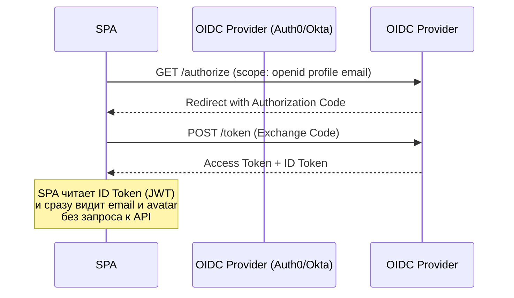

# OpenID Connect (OIDC)

## Суть и решаемая боль
OAuth 2.0 был создан для делегирования прав (дать доступ к API), а не для логина. Когда разработчики начали использовать OAuth 2.0 как "Войти через Facebook/Google", возникла боль: API возвращало просто Access Token (ключ), но само приложение не понимало, *кто* именно вошел, как его зовут, и какой у него email. Разработчикам приходилось делать дополнительные запросы к `/me`, чтобы вытянуть профиль, и парсить кастомные ответы каждого провайдера.

**OpenID Connect (OIDC)** — это тонкая надстройка над OAuth 2.0. Она решает эту боль, стандартизируя процесс **аутентификации**. Вместе с Access Token (ключ от дверей) OIDC выдает **ID Token** (паспорт пользователя), который представляет собой подписанный JWT с базовой информацией: id, email, имя.

## Как это работает на практике

OIDC добавляет scope `openid` к стандартному запросу OAuth 2.0. Результатом обмена кода (Code) становится не только Access Token, но и ID Token.



## Примеры кода

**Структура ID Token (Декодированный JWT):**
```json
// Это то, что SPA получает и может прочитать сразу
{
  "iss": "https://accounts.google.com", // Кто выдал
  "sub": "1234567890",                  // ID пользователя (Subject)
  "aud": "my_client_id",                // Кому выдали (Аудитория)
  "exp": 1690000000,                    // Срок годности
  "name": "Ivan Ivanov",                // Данные из scope 'profile'
  "email": "ivan@example.com"           // Данные из scope 'email'
}
```

**Правильное использование на клиенте:**
```javascript
// ID Token нужен ТОЛЬКО клиенту для UI. Его НЕЛЬЗЯ отправлять на свой API для доступа к ресурсам!
import { jwtDecode } from "jwt-decode";

const handleLoginCallback = async (code) => {
  const { id_token, access_token } = await exchangeCodeForTokens(code);
  
  // Распаковываем паспорт, чтобы показать аватарку в шапке
  const userProfile = jwtDecode(id_token);
  dispatch(setUser(userProfile));
  
  // Access Token сохраняем для походов за данными
  saveAccessToken(access_token);
};
```

## Неочевидные нюансы и трейдоффы
- **ID Token vs Access Token:** Самая частая ошибка новичков — отправлять ID Token в заголовке `Authorization: Bearer <id_token>` на свой бэкенд для запроса данных. Это неправильно! ID Token — это просто бейдж (паспорт) для фронтенда, доказывающий, что юзер залогинился. Для запросов к API всегда используется Access Token.
- **Валидация на фронтенде:** Фронтенд должен проверять `iss` (издатель), `aud` (свой client_id) и подпись (JWKS) ID Токена, чтобы убедиться, что он не подделан злоумышленником.
- **SSO (Single Sign-On):** OIDC — де-факто стандарт для корпоративного SSO. Благодаря стандартизированному эндпоинту `/.well-known/openid-configuration` (Discovery), подключение нового провайдера (Okta, Keycloak) сводится к указанию одного URL.
