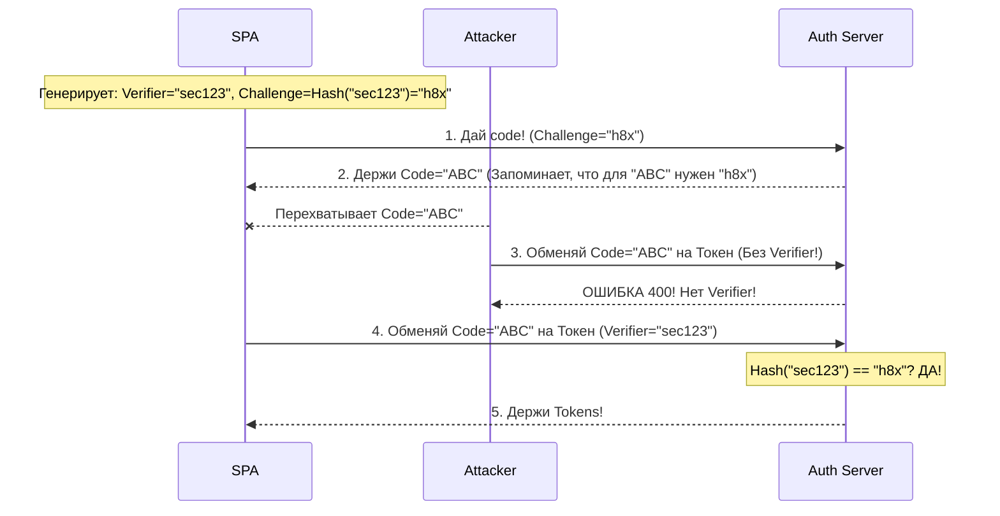

# PKCE (Proof Key for Code Exchange)

## Суть и решаемая боль
В классическом OAuth 2.0 Authorization Code Flow приложение получает `code`, а затем меняет его на токен, подтверждая обмен секретным ключом (`client_secret`). Но что делать SPA (Single Page Applications) или мобильным приложениям? Они работают на устройстве клиента и **не могут безопасно хранить `client_secret`** — любой может открыть DevTools или декомпилировать APK и украсть его.

Если `client_secret` нет, злоумышленник, перехвативший `code` (например, через уязвимость редиректа или вредоносное расширение браузера), может сам обменять его на токен. 

**PKCE (читается как "пикси")** решает эту боль, создавая **динамический секрет для каждой сессии логина**. 

## Как это работает на практике

SPA генерирует случайную строку (`code_verifier`) и ее хэш (`code_challenge`). Хэш отправляется в первом запросе, а оригинал — во втором. Сервер хэширует оригинал и сравнивает с первым отправленным хэшем. Перехватчик, укравший `code`, не знает оригинальный `code_verifier` и не сможет получить токен.



## Примеры кода

**Реализация PKCE на чистом JS:**
```javascript
// 1. Создаем случайный Verifier (минимум 43 символа)
const generateVerifier = () => {
  const array = new Uint32Array(28);
  window.crypto.getRandomValues(array);
  return Array.from(array, dec => ('0' + dec.toString(16)).substr(-2)).join('');
};

// 2. Создаем Challenge (SHA-256 хэш в Base64URL)
const generateChallenge = async (verifier) => {
  const encoder = new TextEncoder();
  const data = encoder.encode(verifier);
  const hash = await window.crypto.subtle.digest('SHA-256', data);
  
  return btoa(String.fromCharCode(...new Uint8Array(hash)))
    .replace(/\+/g, '-').replace(/\//g, '_').replace(/=+$/, '');
};

// Флоу:
const verifier = generateVerifier();
sessionStorage.setItem('pkce_verifier', verifier); // Прячем до 2-го шага
const challenge = await generateChallenge(verifier);

// Шаг 1: Идем на авторизацию
window.location = `/authorize?response_type=code&code_challenge=${challenge}&code_challenge_method=S256`;
```

## Неочевидные нюансы и границы применимости
- **PKCE теперь стандарт для ВСЕХ:** Изначально PKCE придумали для мобильных аппок и SPA (публичных клиентов). Но OAuth 2.1 Security Best Practices требует использовать PKCE **даже для бэкендов** (конфиденциальных клиентов), потому что он защищает от атак с подменой Authorization Code (Authorization Code Injection).
- **Поддержка S256:** `code_challenge_method` должен быть `S256` (хэширование SHA-256). Существует метод `plain` (когда отправляется чистый verifier), но он не дает защиты от перехвата сети и используется только для легаси систем, не поддерживающих криптографию. В 202X `plain` использовать запрещено.
- **Session Storage:** `code_verifier` обычно хранится в `sessionStorage` между редиректами. Если логин открывается в новой вкладке (popup), придется передавать стейт через `postMessage`, так как `sessionStorage` изолирован по вкладкам.
