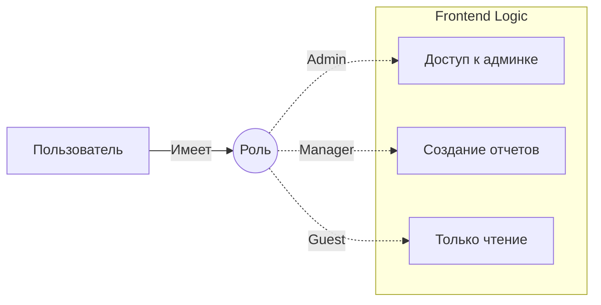

# Role-Based Access Control (RBAC)

## Суть и решаемая боль
В любом приложении, где есть больше одного типа пользователей, встает вопрос разграничения прав. Если захардкодить проверки вида `if (user.id === 1 || user.email === 'admin@mail.com')`, код быстро превратится в неподдерживаемый кошмар. 

**RBAC** решает эту боль через абстракцию: мы группируем пользователей по **ролям** (Admin, Manager, User), а затем выдаем доступ к фичам на основе этих ролей. Это самый популярный, понятный и легко внедряемый паттерн контроля доступа.

## Как это работает на практике

На фронтенде RBAC сводится к проверке поля `role` в объекте пользователя. Эта проверка встраивается в роутер (чтобы не пускать на страницы) и в компоненты (чтобы прятать кнопки).



## Примеры кода

**Антипаттерн (Небезопасный роутинг):**
```tsx
// Роутер никак не защищен. Юзер может просто вбить /admin в строку браузера
// и фронтенд отрендерит страницу, которая упадет при попытке загрузить данные.
<Route path="/admin" component={AdminPanel} />
```

**Правильное решение (Protected Routes с проверкой роли):**
```tsx
// Обертка для защиты роутов
const ProtectedRoute = ({ children, allowedRoles }) => {
  const { user } = useAuth();
  
  if (!user) return <Redirect to="/login" />;
  
  // Проверяем, есть ли роль пользователя в списке разрешенных
  if (!allowedRoles.includes(user.role)) {
    return <Redirect to="/403-forbidden" />;
  }
  
  return children;
};

// Использование
<Route path="/admin">
  <ProtectedRoute allowedRoles={['admin', 'superadmin']}>
    <AdminPanel />
  </ProtectedRoute>
</Route>
```

## Неочевидные нюансы и границы применимости
- **Role Explosion (Взрыв ролей):** Это главная проблема RBAC. Когда бизнес просит "Сделай так, чтобы этот менеджер мог еще и удалять статьи, но только по пятницам", RBAC ломается. Приходится создавать роль `manager_who_can_delete_on_fridays`. Если ролей становится слишком много, нужно переходить на **ABAC** (Attribute-Based) или **PBAC** (Permission-Based).
- **Иллюзия безопасности фронтенда:** Проверка `if (user.role === 'admin')` на клиенте — это исключительно для удобства (UX). Злоумышленник может открыть React DevTools, поменять себе роль в стейте на `admin` и увидеть админ-панель. Но реальные данные он не получит, потому что бэкенд (должен!) проверять JWT-токен на каждом запросе.
