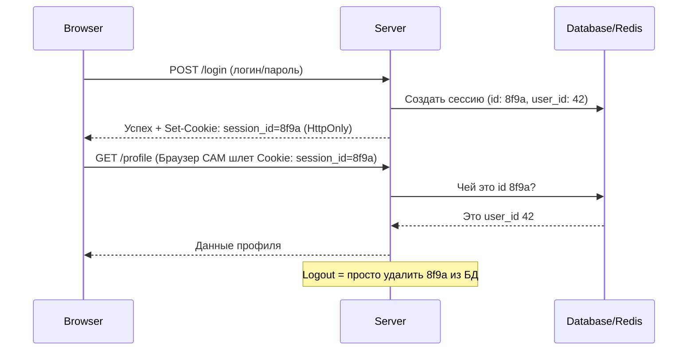

# Session-Based Authentication (Stateful)

## Суть и решаемая боль
HTTP — это протокол без состояния (stateless). Сервер не помнит, кто к нему обращался секунду назад. Чтобы не заставлять пользователя вводить пароль на каждый клик, нам нужен механизм "памяти". 

**Session-Based Authentication** — это классический (Stateful) подход, при котором сервер берет на себя всю работу по запоминанию. Боль, которую он решает — простота и максимальный контроль над сессией. Вы точно знаете, сколько юзеров онлайн, и можете в одну секунду "выкинуть" любого пользователя, просто удалив запись из базы.

## Как это работает на практике

Сервер создает запись в своей памяти (или Redis) с уникальным Session ID, а браузеру отдает куку (Cookie) с этим ID. Браузер **автоматически** прикрепляет эту куку ко всем последующим запросам к этому домену.



## Примеры кода

**Антипаттерн (Чтение сессионной куки фронтендом):**
```javascript
// Разработчик пытается прочитать куку, чтобы понять, залогинен ли юзер
const isAuth = document.cookie.includes('session_id=');
// Это не сработает (и не должно!), если кука HttpOnly. 
// А если она не HttpOnly — вас взломают через XSS.
```

**Правильное решение (Фронтенд ничего не знает о куках):**
```javascript
// Axios/Fetch настраиваются на автоматическую отправку кук (credentials: 'include')
const api = axios.create({
  baseURL: 'https://api.my-app.com',
  withCredentials: true // Обязательно для CORS-запросов с куками!
});

// Для проверки авторизации при старте SPA нужно дернуть бэкенд
api.get('/me')
   .then(res => dispatch(setUser(res.data)))
   .catch(err => dispatch(setGuest()));
```

## Неочевидные нюансы и трейдоффы
- **Защита от XSS из коробки:** Если кука помечена флагами `HttpOnly` и `Secure`, JavaScript к ней доступа не имеет. Даже если хакер внедрит вредоносный скрипт на страницу, он не сможет украсть `session_id`.
- **Уязвимость к CSRF:** Поскольку браузер прикрепляет куки автоматически, хакер может заманить юзера на зловредный сайт, откуда незаметно отправится POST-запрос на ваш сервер. Защита: флаг `SameSite=Lax/Strict` на куках и использование Anti-CSRF токенов.
- **Оверхед бэкенда (Масштабирование):** При каждом запросе сервер должен лезть в БД/Redis, чтобы проверить сессию. Если у вас 1 миллион RPS, Redis станет бутылочным горлышком. Именно поэтому микросервисы чаще выбирают Token-based (JWT) подход.
