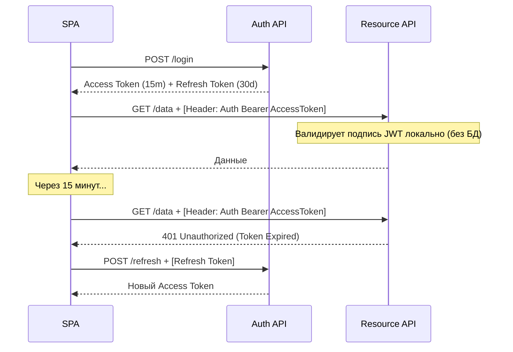

# Token-Based Authentication (Stateless / JWT)

## Суть и решаемая боль
При микросервисной архитектуре классические сессии ломаются: если сервис А выдал пользователю Session ID, сервис Б об этом не знает (если у них нет общей базы Redis). Боль масштабирования и единой точки отказа (Stateful).

**Token-Based Authentication** (чаще всего реализуется через JWT - JSON Web Tokens) решает эту боль, делая сервер **Stateless** (без состояния). Вместо того чтобы хранить ID сессии в базе, сервер выдает клиенту криптографически подписанный документ (токен), в котором уже зашиты данные юзера (`id=42`, `role=admin`). Любой микросервис, зная публичный ключ, может проверить подпись и поверить токену, не обращаясь к базе данных.

## Как это работает на практике

Сервер выдает пару: короткоживущий **Access Token** (на 15 минут) для доступа к данным и долгоживущий **Refresh Token** (на месяц) для получения новых Access токенов, когда старый протухнет.



## Примеры кода

**Антипаттерн (Необработанное протухание токена):**
```javascript
// Если токен протух, юзер увидит ошибку и ему придется логиниться заново
const fetchData = async () => {
  const token = localStorage.getItem('access');
  const res = await fetch('/api/data', { headers: { Authorization: `Bearer ${token}` }});
  if (res.status === 401) {
    alert('Сессия истекла, войдите заново');
    window.location = '/login';
  }
};
```

**Правильное решение (Автоматический Refresh через Axios Interceptor):**
```javascript
// Перехватываем 401 ошибки, делаем silent refresh и повторяем оригинальный запрос
api.interceptors.response.use(
  (response) => response,
  async (error) => {
    const originalRequest = error.config;
    // Если 401 и мы еще не пытались обновить (чтобы не уйти в бесконечный цикл)
    if (error.response.status === 401 && !originalRequest._retry) {
      originalRequest._retry = true;
      try {
        const { data } = await api.post('/auth/refresh');
        // Сохраняем новый токен
        saveAccessToken(data.accessToken);
        // Повторяем упавший запрос с новым токеном
        originalRequest.headers.Authorization = `Bearer ${data.accessToken}`;
        return api(originalRequest);
      } catch (refreshError) {
        // Если refresh протух - разлогиниваем окончательно
        forceLogout();
      }
    }
    return Promise.reject(error);
  }
);
```

## Неочевидные нюансы и границы применимости
- **Отзыв токена (Revocation Problem):** Самая большая проблема JWT. Поскольку сервер не хранит сессии, он не может инвалидировать Access Token до окончания его срока действия. Если токен украли, хакер будет иметь доступ все эти 15 минут. Решение — делать время жизни токена очень коротким (5-10 минут) или держать `Blacklist` на бэкенде (что возвращает нас к Stateful подходу).
- **Размер имеет значение:** Сессионная кука весит 32 байта. JWT токен с кучей ролей и прав может весить 2-4 КБ. Отправляя его на *каждый* запрос, мы создаем значительный оверхед на трафик.
