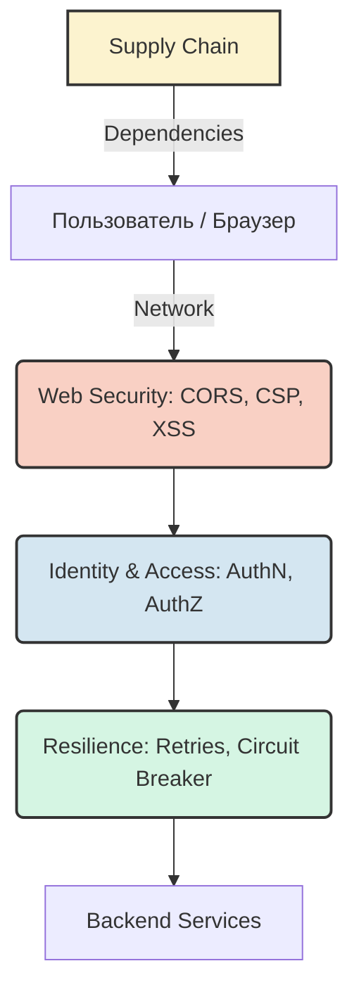

# Безопасность и надежность (Security & Resilience)

## Суть и решаемая боль
В мире frontend-разработки мы часто фокусируемся на фичах, скорости и UI/UX, забывая о том, что веб — это враждебная среда. Ненадежные сети, злоумышленники, уязвимые зависимости и ошибки на сервере — всё это может разрушить пользовательский опыт или привести к утечке данных. Этот раздел архитектуры решает фундаментальную боль: **как сделать приложение пуленепробиваемым**, чтобы оно не падало при первой же ошибке сети и не отдавало токены при банальном XSS.

Мы переходим от подхода «работает в идеальных условиях» к «работает в реальном мире», выстраивая эшелонированную оборону (Defense in Depth) и закладывая паттерны устойчивости (Resilience) прямо в архитектуру.

## Архитектура Безопасности и Надежности



## Как это работает на практике
Вместо того чтобы латать дыры по факту инцидентов, мы внедряем безопасность и надежность на этапе проектирования (Security/Reliability by Design). Это означает:
- **Web Security**: Использование CSP, строгих куки (SameSite) и санитизации данных.
- **Identity & Access**: Правильное хранение токенов, безопасные флоу (OAuth, PKCE) и строгий контроль доступа (RBAC/ABAC).
- **Resilience**: Если что-то упало — мы падаем изящно (Graceful Degradation), делаем ретраи и показываем Fallback UI, а не белый экран смерти.
- **Supply Chain Security**: Мы доверяем, но проверяем NPM-пакеты, используем lock-файлы и сканируем зависимости.

## Пример: Идеальный vs Реальный мир

**Антипаттерн (Оптимистичный подход):**
```javascript
// Падает при любой сетевой ошибке, нет обработки, токен в localStorage
const fetchUserData = async () => {
    const token = localStorage.getItem('token');
    const res = await fetch('/api/user', { headers: { Authorization: `Bearer ${token}` } });
    return await res.json(); 
};
```

**Правильное решение (С учетом безопасности и надежности):**
```javascript
// Токен скрыт (HttpOnly cookies), есть ретрай и обработка ошибок
import { fetchWithRetry } from '@/lib/network';

const fetchUserData = async () => {
    try {
        // Запрос идет с credentials: 'include', токен прикрепляется браузером
        const res = await fetchWithRetry('/api/user', { retries: 3 });
        return await res.json();
    } catch (error) {
        // Fallback-поведение
        reportErrorToSentry(error);
        return { isGuest: true };
    }
};
```

## Неочевидные нюансы и трейдоффы
- **UX vs Security**: Жесткий CSP может сломать аналитику, а короткоживущие токены заставляют пользователя чаще перелогиниваться. Баланс — это самое сложное.
- **Оверхед на разработку**: Внедрение правильного Circuit Breaker или ABAC на фронтенде требует времени и усложняет кодовую базу. Применимо для энтерпрайза, но может быть оверхедом для пет-проекта.
- **Иллюзия безопасности**: Frontend полностью подконтролен пользователю. Любая безопасность на клиенте (скрытие кнопок, валидация) — это лишь UX, реальная безопасность всегда обеспечивается бэкендом.
