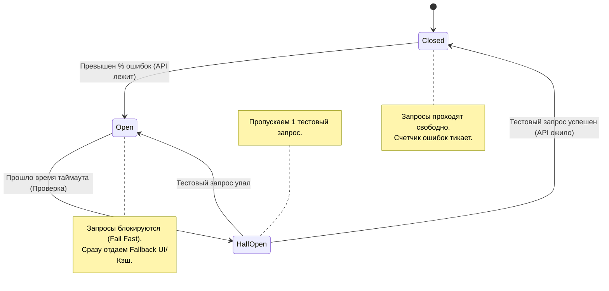

Паттерн Circuit Breaker (Предохранитель) пришел во фронтенд из распределенных систем. Его суть в том, чтобы **не пытаться выполнить операцию, которая заведомо обречена на провал**.

## 1. Какую боль мы решаем?
Представьте: фронтенд делает запрос к микросервису аналитики, но сервис "упал" или сильно тормозит (таймаут 30 секунд). Если пользователь активно кликает по интерфейсу, фронтенд начнет плодить десятки зависших запросов. Браузер исчерпает лимит соединений к домену (обычно 6), вкладка зависнет, а бэкенд, когда начнет оживать, получит шквал ретраев и ляжет снова (Thundering Herd problem).

Circuit Breaker решает это, выступая в роли умного рубильника между клиентом и API.



## 2. Как это работает в коде (Axios Interceptor)

Вместо того, чтобы каждый раз ждать таймаут от мертвого сервиса, мы прерываем запросы на клиенте.

```typescript
// Простая реализация Circuit Breaker
class CircuitBreaker {
  state = 'CLOSED'; // CLOSED, OPEN, HALF_OPEN
  failureCount = 0;
  failureThreshold = 3; // 3 ошибки подряд = рубильник падает
  resetTimeout = 10000; // Ждем 10 сек перед тестовым запросом
  lastErrorTime = 0;

  async execute(requestFn: () => Promise<any>) {
    if (this.state === 'OPEN') {
      if (Date.now() - this.lastErrorTime > this.resetTimeout) {
        this.state = 'HALF_OPEN'; // Пробуем сделать тестовый запрос
      } else {
        throw new Error('Circuit Breaker is OPEN. Fail fast.');
      }
    }

    try {
      const response = await requestFn();
      this.reset();
      return response;
    } catch (error) {
      this.recordFailure();
      throw error;
    }
  }

  recordFailure() {
    this.failureCount++;
    this.lastErrorTime = Date.now();
    if (this.failureCount >= this.failureThreshold) {
      this.state = 'OPEN';
    }
  }

  reset() {
    this.failureCount = 0;
    this.state = 'CLOSED';
  }
}
```

## 3. Границы применимости и трейдоффы

* **Синхронизация между вкладками:** Если у пользователя открыто 5 вкладок, то в каждой будет свой экземпляр Circuit Breaker. Если API падает, каждая вкладка сделает по 3 неудачных запроса. *Решение:* Хранить стейт (Closed/Open) и время последней ошибки в `localStorage` или `BroadcastChannel`, чтобы вкладки знали о падении сервиса сообща.
* **Использование с Fallback UI / Cache:** Идеально, если при состоянии `OPEN` фронтенд не просто падает с ошибкой, а достает последние валидные данные из `IndexedDB` (Stale-while-revalidate) или показывает заглушку: «Сервис временно недоступен, показываем старые данные».
* **Оверхед на стейт-менеджмент:** Не нужно оборачивать каждый GET-запрос в Circuit Breaker. Он необходим только для критичных или нестабильных сервисов (например, тяжелые отчеты, сторонние интеграции), либо на уровне глобального фасада API.
