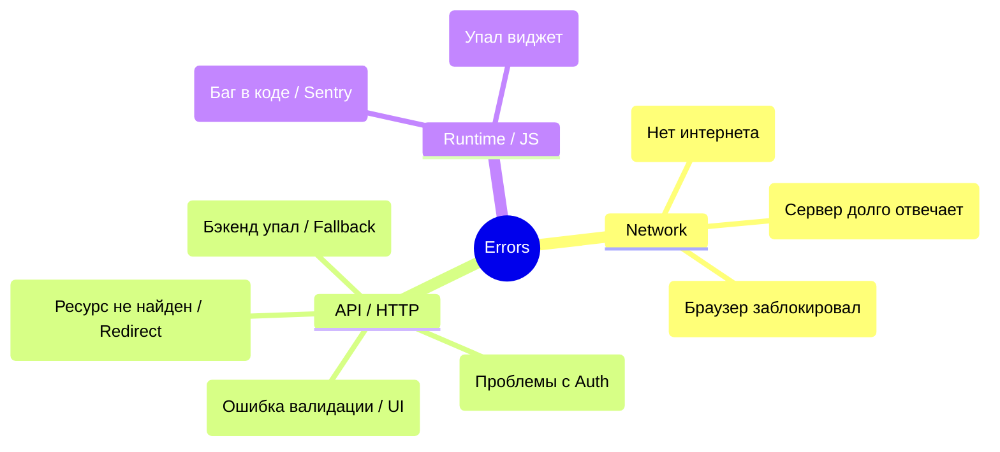

# Error Taxonomy (Таксономия ошибок)

## Суть и решаемая боль
"Произошла ошибка, попробуйте позже" — это худший UX из возможных. Когда фронтенд не умеет отличать упавший интернет от протухшего токена или бага в собственном коде, приложение превращается в черный ящик. Боль разработчиков — невозможность правильно реагировать на разные типы сбоев.

**Error Taxonomy (Классификация ошибок)** — это архитектурный подход, при котором фронтенд четко разделяет все возможные ошибки на категории и для каждой категории имеет заранее продуманный сценарий обработки (UX, ретраи, логирование).

## Как это работает на практике

Мы делим все ошибки на три больших домена: **Network (Сеть)**, **HTTP/API (Бэкенд)** и **Runtime (Фронтенд)**.



## Примеры кода

**Антипаттерн (Универсальная глупая обработка):**
```javascript
try {
  await fetchUserData();
} catch (error) {
  // Юзер не поймет, что это значит. Мы не знаем, надо ли ретраить.
  toast.error(error.message); 
}
```

**Правильное решение (Маппинг ошибок на бизнес-логику):**
```typescript
class AppError extends Error {
  constructor(public type: 'NETWORK' | 'AUTH' | 'VALIDATION' | 'SERVER', message: string) {
    super(message);
  }
}

// В глобальном обработчике (Axios Interceptor или React Context)
const handleError = (error: AppError) => {
  switch(error.type) {
    case 'NETWORK':
      // Показываем плашку "Вы оффлайн" и запускаем background sync
      showOfflineBanner(); 
      break;
    case 'AUTH':
      // Редирект на логин с сохранением текущего URL (ReturnTo)
      redirectToLogin(); 
      break;
    case 'VALIDATION':
      // Подсвечиваем поля красным в форме
      highlightFormFields(error.payload); 
      break;
    case 'SERVER':
      // Показываем Fallback UI и отправляем в Sentry
      show500Page();
      Sentry.captureException(error);
      break;
  }
}
```

## Неочевидные нюансы и границы применимости
- **Тихие ошибки (Silent Errors):** Не каждую ошибку нужно показывать пользователю. Если упал запрос за счетчиком аналитики или фоновым обновлением списка друзей — нужно просто залогировать это и молча продолжить работу. 
- **Абстракция над Fetch/Axios:** Чтобы таксономия работала, фронтенд не должен бросать сырые `TypeError` из недр `fetch`. Нужен слой Data Fetching (например, класс `ApiClient`), который ловит все сетевые исключения и оборачивает их в типизированные бизнес-ошибки (`DomainError`).
- **Грань UX и Безопасности:** Ошибки 403 (Forbidden) никогда не должны раскрывать причину запрета. Возвращать `403: "У вас нет роли Admin"` — небезопасно. Лучше использовать универсальное `404 Not Found` (чтобы скрыть сам факт существования ресурса) или сухое `Access Denied`.

## Связанные разделы
- [[../Архитектура обработки ошибок/00 Обзор и таксономия ошибок|Архитектура обработки ошибок (Обзор и таксономия)]]
- [[../Архитектура обработки ошибок/01 Подход на исключениях (Throw & Catch)|1. Throw & Catch (Кастомные классы & Rethrow)]]
- [[../Архитектура обработки ошибок/02 Result-контейнеры и Error-first|2. Result-контейнеры и Error-first]]
- [[../Архитектура обработки ошибок/03 Railway Oriented Programming (ROP)|3. Railway Oriented Programming (ROP)]]
- [[../Архитектура обработки ошибок/04 Гибридная архитектура обработки|4. Гибридная архитектура обработки]]

