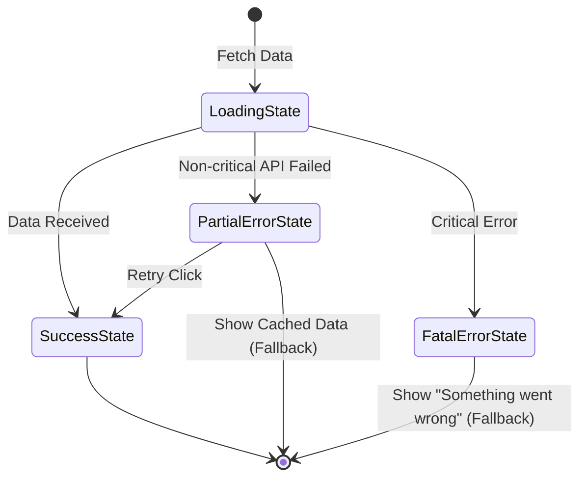

# Fallback UI (Запасной интерфейс)

## Суть и решаемая боль
Идеального мира не существует: бэкенд будет падать, запросы будут таймаутить, а скрипты — ломаться. Если при этом пользователь увидит белый экран или сломанную верстку с `undefined`, он закроет вкладку и не вернется. Боль заключается в потере доверия к приложению.

**Fallback UI** — это паттерн Graceful Degradation (изящной деградации) на уровне интерфейса. Вместо того чтобы ломаться целиком, мы показываем "запасной" вариант UI, который объясняет, что пошло не так, снижает стресс пользователя и, по возможности, предлагает пути выхода.

## Как это работает на практике

Fallback UI тесно связан с Error Boundaries и Data Fetching. Он активируется в трех случаях:
1. Во время загрузки (Skeleton/Spinner).
2. При частичной ошибке данных (Пустое состояние / Empty State).
3. При фатальной ошибке компонента (Error Boundary Fallback).



## Примеры кода

**Антипаттерн (Жесткий краш или игнорирование ошибки):**
```tsx
const UserProfile = ({ user }) => {
  // Если user === null (ошибка API), тут упадет TypeError
  return <h1>Привет, {user.name}</h1>;
}
```

**Правильное решение (Проактивный Fallback):**
```tsx
const UserProfile = ({ user, isLoading, error, onRetry }) => {
  // Fallback 1: Состояние загрузки
  if (isLoading) return <ProfileSkeleton />;
  
  // Fallback 2: Ошибка загрузки
  if (error) {
    return (
      <div className="fallback-card">
        <p>Не удалось загрузить профиль</p>
        <button onClick={onRetry}>Попробовать снова</button>
      </div>
    );
  }
  
  // Успех
  return <h1>Привет, {user.name}</h1>;
}
```

## Неочевидные нюансы и границы применимости
- **Контекстность Fallback'а:** Запасной интерфейс должен соответствовать размеру и месту упавшего компонента. Если упала карточка товара в гриде, покажите серый квадрат с иконкой ошибки размером с карточку товара. Не надо показывать полноэкранную 500-ю ошибку.
- **Оффлайн-режим как Fallback:** Если у пользователя пропал интернет, лучшим Fallback UI будет не сообщение "Ошибочка", а отображение закешированных данных (через Service Worker или React Query) с маленькой плашкой "Вы оффлайн, показаны старые данные".
- **Опасность Retry-шторма:** Кнопка "Попробовать снова" в Fallback UI — отличный UX. Но если пользователь начнет яростно по ней кликать при лежащем бэкенде, он устроит DDoS. Кнопка должна иметь *debounce* или экспоненциальную задержку после нажатия (Throttle).
