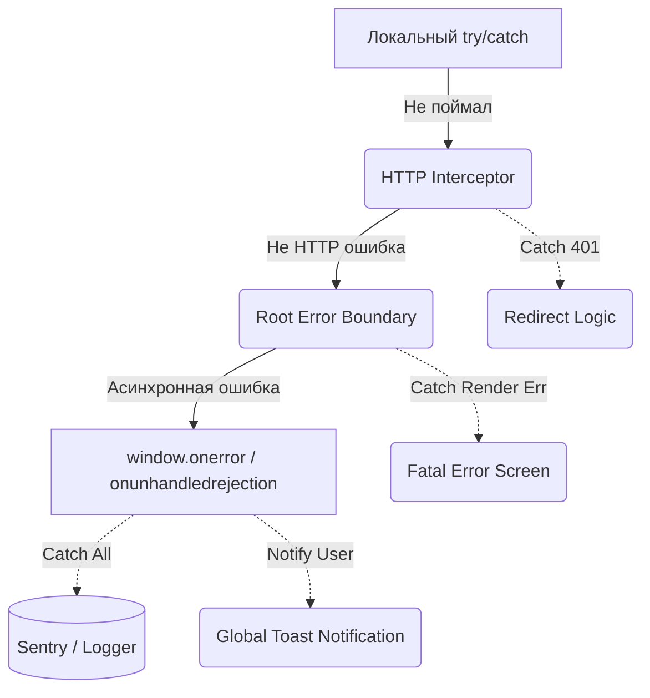

# Global Error Handling (Глобальная обработка ошибок)

## Суть и решаемая боль
Если разработчик забыл написать `try/catch` для асинхронного вызова, то `Unhandled Promise Rejection` улетит "в космос" и застрянет в консоли браузера. Приложение может оказаться в неконсистентном состоянии: спиннер будет крутиться вечно, а кнопка "Сохранить" останется заблокированной. Боль в том, что локальных `try/catch` никогда не бывает достаточно.

**Global Error Handling** — это система перехвата "последней надежды". Это архитектурный слой, который ловит абсолютно все неперехваченные ошибки (синтаксические, сетевые, логические), логирует их для разработчиков и показывает универсальный UI, спасая приложение от зависания.

## Как это работает на практике

На фронтенде глобальная обработка настраивается на уровне самого браузера (слушатели событий `window`) и на уровне корневых оберток фреймворка (Global Error Boundary, Axios Interceptors).



## Примеры кода

**Антипаттерн (Вечный лоадер):**
```javascript
const saveDoc = async () => {
  setLoading(true);
  // Если тут вылетит ошибка, setLoading(false) никогда не вызовется
  await api.post('/docs', data); 
  setLoading(false); 
};
```

**Правильное решение (Глобальный перехват + локальный finally):**
```javascript
// 1. На уровне index.js перехватываем все, что пролетело мимо
window.addEventListener('unhandledrejection', (event) => {
  Sentry.captureException(event.reason);
  showGlobalToast('Произошла непредвиденная ошибка. Мы уже чиним.');
  // Не даем браузеру спамить в консоль
  event.preventDefault(); 
});

// 2. В компоненте заботимся только об UI стейте
const saveDoc = async () => {
  try {
    setLoading(true);
    await api.post('/docs', data);
    toast.success('Сохранено');
  } finally {
    // Выполнится всегда, предотвращая зависание UI
    setLoading(false); 
  }
};
```

## Неочевидные нюансы и границы применимости
- **Утечка памяти (Memory Leaks):** Если глобальный обработчик показывает Toast-уведомление на каждую сетевую ошибку, а приложение находится оффлайн и делает polling (запросы каждые 5 сек), пользователь получит сотни всплывающих окон. Нужен дедупликатор ошибок (Throttle) на уровне логгера.
- **Маскировка багов:** Глобальный обработчик может быть "слишком хорошим". Если он молча ловит все `TypeErrors` и проглатывает их, приложение не падает, но работает криво. Разработчики не увидят проблему в консоли. В режиме `development` глобальный перехватчик часто отключают или делают его максимально шумным (через `console.error`).
- **CORS и window.onerror:** Если падает скрипт, загруженный с другого домена (например, CDN) без заголовка `crossorigin="anonymous"`, глобальный `window.onerror` получит бесполезное сообщение `Script error.`, без стак-трейса и номера строки. Это механизм безопасности браузера для защиты от утечек.
