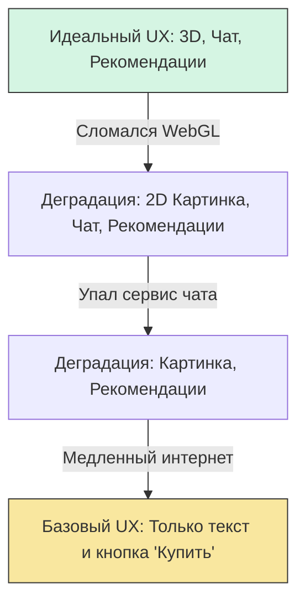

# Graceful Degradation (Изящная деградация)

## Суть и решаемая боль
Раньше сайты делались по принципу "Всё или ничего". Если у пользователя старый браузер или отвалился кусок скрипта, сайт просто превращался в нечитаемое месиво. Боль разработчиков — невозможность поддерживать 100% идеальный опыт на всех устройствах, при любой скорости сети и любых сбоях API.

**Graceful Degradation** — это философия проектирования. Мы строим приложение под идеальные, современные условия (High-end). Но если что-то идет не так (старый Safari, упал сервер рекомендаций, медленный 3G), приложение "деградирует" плавно, отключая некритичные фичи, но сохраняя основную бизнес-функцию.

## Как это работает на практике

Представьте интернет-магазин. Основная функция — купить товар. Дополнительные фичи — 3D-модель товара, блок "С этим покупают" и живой чат.
Если падает микросервис чата, мы не должны показывать ошибку 500 на всей странице. Чат просто исчезает, а юзер продолжает покупать.



## Примеры кода

**Антипаттерн (Жесткая зависимость от фичи):**
```tsx
const ProductPage = ({ product }) => {
  // Если браузер не поддерживает WebGL, упадет весь компонент
  const model3d = renderWebGL(product.modelUrl);
  
  return (
    <div>
      {model3d}
      <button>Купить</button>
    </div>
  )
}
```

**Правильное решение (Изящная деградация через Fallback):**
```tsx
const ProductImage = ({ product }) => {
  const isWebGLSupported = checkWebGLSupport();
  
  // Если фича не поддерживается или падает, отдаем статичную картинку
  if (!isWebGLSupported) {
    return ;
  }
  
  return <ErrorBoundary fallback={}>
           <WebGLViewer url={product.modelUrl} />
         </ErrorBoundary>;
}
```

## Неочевидные нюансы и границы применимости
- **Graceful Degradation vs Progressive Enhancement:** Это два брата, но они идут в разные стороны. Graceful Degradation начинает с "полного фарша" и отрезает лишнее при сбоях (сверху вниз). Progressive Enhancement начинает с голого HTML и наслаивает скрипты/CSS, если браузер их тянет (снизу вверх). Сегодня в SPA чаще применяют именно деградацию (отлавливают ошибки компонентов и прячут их).
- **Скрытие вместо ремонта:** Главное правило деградации некритичных сервисов — скрыть их тихо. Если у вас на главной странице упал блок "Новости", не пишите красным "ОШИБКА ЗАГРУЗКИ НОВОСТЕЙ". Просто схлопните этот блок через CSS (`display: none` в Fallback компоненте). Пользователь даже не заметит, что что-то сломалось, и его UX останется позитивным.
