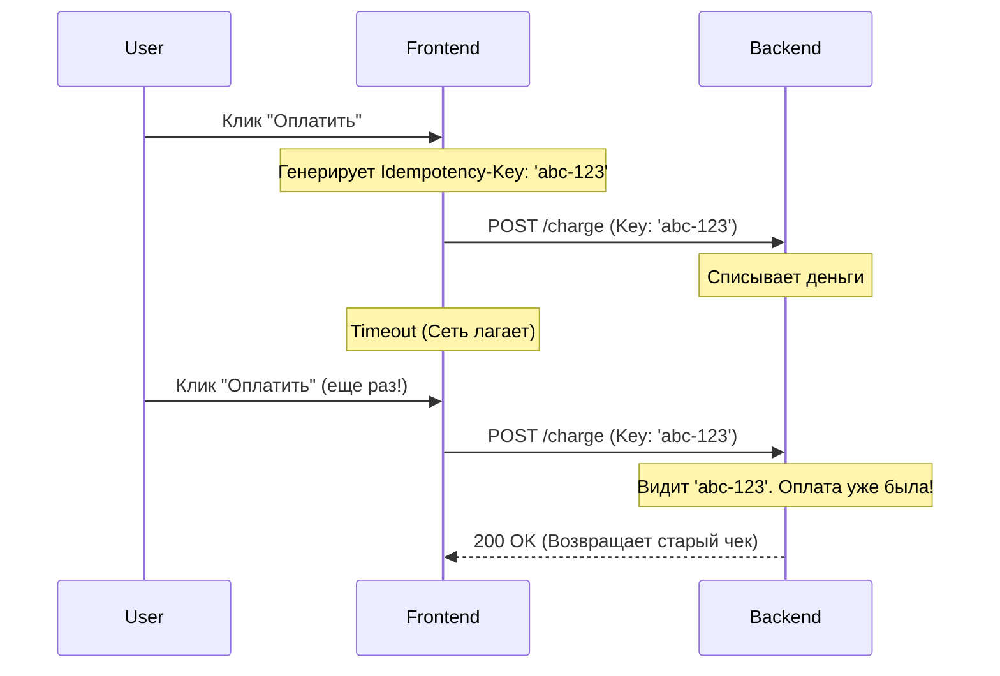

# Idempotency (Идемпотентность на клиенте)

## Суть и решаемая боль
Пользователь заполняет огромную форму оплаты и нажимает "Оплатить". Интернет на секунду пропадает, ответа нет. Пользователь паникует и нажимает "Оплатить" еще 3 раза. Сервер в итоге получает 4 запроса и списывает деньги 4 раза. 
Боль: сетевые задержки и нестабильный коннект приводят к дублированию критических действий (покупки, создания сущностей).

**Idempotency (Идемпотентность)** — это свойство операции давать один и тот же результат независимо от того, выполнена ли она один раз или сто раз. На бэкенде это решается через `Idempotency-Key`, но фронтенд обязан правильно сгенерировать и отправить этот ключ, а также заблокировать UI.

## Как это работает на практике

Для всех `POST/PUT/PATCH` запросов, которые меняют состояние системы (особенно связанные с деньгами), фронтенд генерирует уникальный UUID для конкретной "попытки" и шлет его в заголовках. Если запрос отправляется повторно, сервер видит старый UUID и просто возвращает закэшированный первый ответ, не выполняя логику заново.



## Примеры кода

**Антипаттерн (Наивная отправка):**
```javascript
// Никак не защищено от двойного клика, кроме как локальным стейтом isLoading (который может сброситься)
const handlePayment = async () => {
  setIsLoading(true);
  await fetch('/api/pay', { method: 'POST', body: data });
  setIsLoading(false);
}
```

**Правильное решение (Генерация ключа идемпотентности):**
```javascript
import { v4 as uuidv4 } from 'uuid';

// Генерируем ключ ОДИН раз при открытии формы/модалки, 
// а не внутри функции сабмита!
const [idempotencyKey] = useState(() => uuidv4());

const handlePayment = async () => {
  try {
    setIsLoading(true);
    await fetch('/api/pay', {
      method: 'POST',
      headers: {
        'Idempotency-Key': idempotencyKey // Stripe-like подход
      },
      body: JSON.stringify(data)
    });
  } catch (error) {
    // Если тут таймаут, юзер нажмет кнопку снова,
    // но idempotencyKey останется тем же!
    showError('Что-то пошло не так, попробуйте еще раз');
  }
}
```

## Неочевидные нюансы и трейдоффы
- **Время жизни ключа (Scope):** Ключ идемпотентности должен генерироваться **не** на каждый клик мышки (иначе это будут разные транзакции), и **не** один раз на сессию (иначе юзер сможет купить только один товар за день). Ключ должен привязываться к "Интенту" (намерению). Обычно его генерируют при рендере компонента "Форма оплаты" или привязке к конкретной корзине.
- **GET и DELETE идемпотентны по умолчанию:** Архитектура REST подразумевает, что `GET` (прочитать) и `DELETE` (удалить запись ID=5) можно вызывать бесконечное число раз с одним и тем же итоговым состоянием базы. Для них `Idempotency-Key` не нужен. Он нужен для `POST`.
- **Бэкенд должен поддерживать:** Идемпотентность не работает, если бэкенд игнорирует ваш заголовок. Фронтенд и бэкенд должны договориться о контракте (`Idempotency-Key` или `X-Request-ID`).
