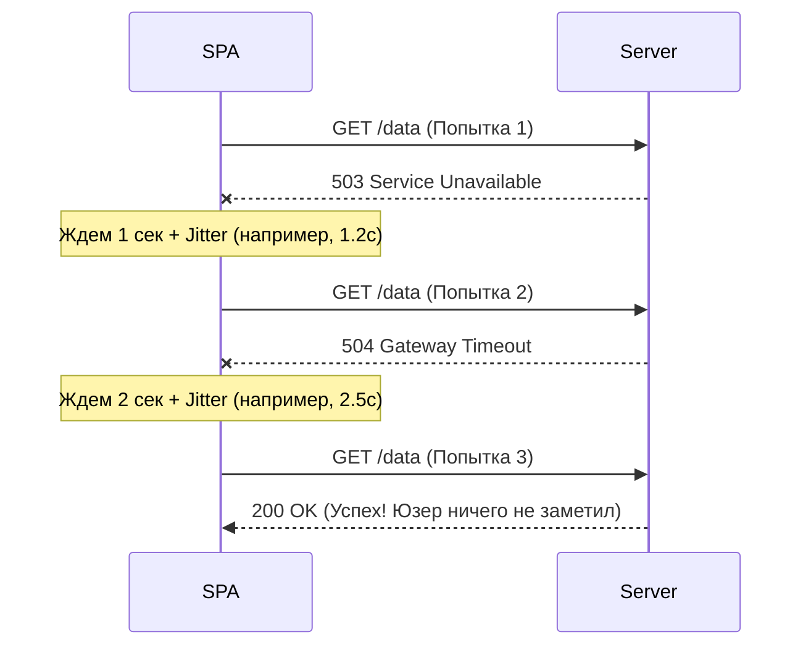

# Retry Strategies (Стратегии повторных попыток)

## Суть и решаемая боль
Мобильный интернет — это хаос. Юзер заезжает в туннель, переключается между вышками связи или ловит секундный таймаут от микросервиса. Если при любой сетевой ошибке мы просто сдаемся и показываем "Ошибка загрузки", мы теряем конверсию и раздражаем пользователя.
Боль: наивный подход ломает UX, а агрессивный повтор запросов ломает бэкенд.

**Retry Strategies** — это умный механизм повторения упавших запросов. Мы прячем сетевые сбои от пользователя, пытаясь выполнить операцию снова, но делаем это так, чтобы не создать DDoS-атаку на собственный сервер.

## Как это работает на практике

Хорошая стратегия повторов строится на трех китах:
1. **Exponential Backoff (Экспоненциальная задержка):** Каждая следующая попытка ждет дольше предыдущей (1с, 2с, 4с, 8с).
2. **Jitter (Джиттер / Разброс):** Добавление случайной миллисекундной задержки, чтобы тысячи клиентов не долбили сервер одновременно после его рестарта.
3. **Idempotency Check:** Проверка, *можно ли вообще* повторять этот запрос безопасно.



## Примеры кода

**Антипаттерн (Жесткий и глупый Retry):**
```javascript
// ОЧЕНЬ ПЛОХО! 
// 1. Бесконечный цикл при 404/403.
// 2. Нет задержки — убьет сервер миллионом запросов в секунду.
const fetchData = async () => {
  let success = false;
  while (!success) {
    try {
      await api.get('/data');
      success = true;
    } catch (e) {
      // Игнорируем и долбим дальше
    }
  }
}
```

**Правильное решение (Axios Retry с Exponential Backoff):**
```javascript
import axiosRetry from 'axios-retry';

// Настраиваем глобальный инстанс Axios
axiosRetry(api, {
  retries: 3, // Максимум 3 попытки
  // Настраиваем Exponential Backoff: 1000мс, 2000мс, 4000мс
  retryDelay: (retryCount) => {
    return axiosRetry.exponentialDelay(retryCount);
  },
  // Ретро-проверка: повторяем только сетевые ошибки или 5xx (сервер упал). 
  // Мы НЕ повторяем 400 (неверный запрос) или 404!
  retryCondition: (error) => {
    return axiosRetry.isNetworkOrIdempotentRequestError(error) || error.response?.status >= 500;
  }
});
```

## Неочевидные нюансы и трейдоффы
- **Проблема POST запросов:** По умолчанию библиотеки (включая Axios Retry и React Query) **не повторяют POST/PATCH/DELETE** запросы. Почему? Потому что если запрос упал по таймауту, фронтенд не знает, дошел ли он до базы данных сервера. Если вы повторите POST без `Idempotency-Key`, вы можете дважды снять деньги с карты или создать два поста. 
- **UX при долгих попытках:** Если Exponential Backoff дошел до 8 секунд ожидания, юзер будет смотреть на крутящийся спиннер очень долго и подумает, что приложение зависло. Имеет смысл на второй попытке добавлять надпись `(Медленное соединение, пытаемся восстановить...)`.
