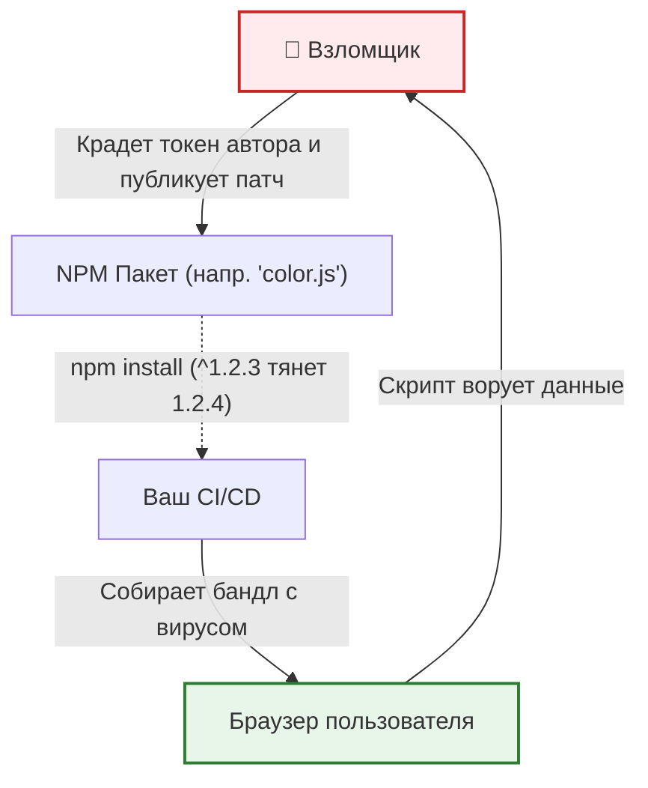

Атака на цепочку поставок (Supply Chain Attack) через NPM-пакеты — одна из самых опасных угроз для современного фронтенда. Мы тянем сотни мегабайт стороннего кода (React, lodash, утилиты), и если хотя бы один разработчик популярного пакета окажется взломан (или сам решит внедрить закладку), вредоносный код попадет прямо к нашим пользователям.

## 1. Суть проблемы (Какую боль решаем?)
Представьте, что вы используете удобную библиотеку для форматирования дат. В один прекрасный день её автор выпускает минорный патч (например, с `1.2.3` на `1.2.4`), в который вшит код для кражи переменных окружения (например, ключей AWS) во время сборки, или скрипт для перехвата паролей пользователей прямо в браузере. Если у вас не зафиксированы версии или нет проверок, этот патч автоматически затянется при следующем `npm install`.



## 2. Как это выглядит на практике

### Антипаттерн (Уязвимый подход)
```json
// package.json
{
  "dependencies": {
    // ❌ ОПАСНО: '^' разрешает автоматическое минорное обновление
    "lodash": "^4.17.20", 
    // ❌ КРИТИЧНО: '*' разрешает тянуть ЛЮБУЮ последнюю версию (даже мажорную)
    "moment": "*" 
  }
}
```

### Правильный подход (Защищенный код)
Фиксация версий и использование lock-файлов (`package-lock.json` или `yarn.lock`) гарантирует, что дерево зависимостей будет идентичным на всех машинах.

```json
// package.json
{
  "dependencies": {
    // ✅ БЕЗОПАСНО: Жесткая фиксация версии
    "lodash": "4.17.21" 
  }
}
```

Аудит уязвимостей в CI/CD:
```bash
# ✅ Проверка на известные уязвимости (CVE) перед сборкой
npm ci # Использует ТОЛЬКО package-lock.json, падает если он расходится с package.json
npm audit --audit-level=high # Упадет с ошибкой, если есть уязвимости уровня High/Critical
```

## 3. Неочевидные нюансы и трейдоффы

* **Усталость от ложных тревог (Audit Fatigue):** Команда `npm audit` часто выдает десятки "Critical" уязвимостей в пакетах, которые используются только для локальной сборки (например, в плагинах Webpack или Jest). Эти уязвимости не попадают в итоговый бандл браузера (клиента) и не несут угрозы. *Решение:* Использовать утилиты вроде `npm-audit-resolver` или `better-npm-audit`, чтобы игнорировать нерелевантные угрозы (DevDependencies), иначе разработчики начнут просто игнорировать красные ворнинги.
* **Обновления ломают код:** Жесткая фиксация версий спасает от сюрпризов, но приводит к тому, что проект быстро устаревает. Если полгода не обновлять пакеты, переход на новую версию React станет мучительным. *Решение:* Настроить Dependabot или Renovate, которые будут автоматически создавать Pull Requests с обновлениями и прогонять на них автотесты.
* **Иллюзия безопасности:** `npm audit` находит только *известные* уязвимости, которые уже добавлены в базы CVE. Если пакет взломали 5 минут назад, аудит покажет "0 vulnerabilities". Истинная защита — это минимизация числа зависимостей (писать простую логику руками вместо установки пакета `is-even`) и ревью изменений в lock-файлах.
