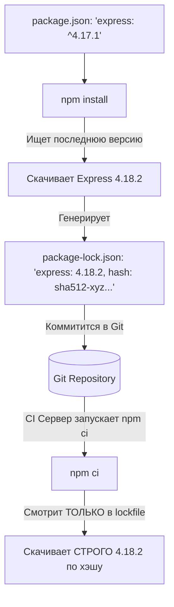

# Lockfiles (Файлы блокировки зависимостей)

## Суть и решаемая боль
В `package.json` зависимости часто указываются с "кареткой": `"react": "^18.2.0"`. Это значит: "скачай версию 18.2.0 или любую новую минорную/патч-версию". 
Боль: вы делаете сборку сегодня — всё работает. Через месяц вы деплоите этот же код, npm скачивает `18.3.0` (потому что она вышла вчера), в которой есть баг, и ваш продакшен падает. Хуже того: автор пакета мог внедрить бэкдор в патч-версию, и вы скачаете его автоматически.

**Lockfile (`package-lock.json`, `yarn.lock`, `pnpm-lock.yaml`)** решает эту боль, жестко "замораживая" (locking) конкретные версии абсолютно всего дерева зависимостей (включая транзитивные) на момент последней успешной установки.

## Как это работает на практике

Lockfile — это огромный слепок состояния `node_modules`. Он гарантирует, что если Вася установил зависимости на Windows в понедельник, а CI-сервер на Linux в пятницу — они получат **побайтово идентичное** дерево пакетов.



## Примеры команд и поведения

**Антипаттерн (Использование npm install в CI):**
```bash
# В CI-пайплайне разработчик пишет:
npm install
npm run build

# Проблема: npm install может обновить package-lock.json и скачать новые версии!
# Вы теряете детерминированность сборки.
```

**Правильное решение (Использование npm ci):**
```bash
# В CI или при деплое ВСЕГДА используется 'npm ci' (Clean Install)
npm ci
npm run build

# npm ci:
# 1. Удаляет существующую папку node_modules
# 2. Строго следует package-lock.json (упадет с ошибкой, если он рассинхронизирован с package.json)
# 3. Работает в 2 раза быстрее
# 4. Никогда не изменяет package-lock.json
```

## Неочевидные нюансы и границы применимости
- **Hash Integrity (Проверка целостности):** Lockfile содержит не только версии, но и криптографические хэши файлов (поле `integrity: "sha512-..."`). Если злоумышленник взломает NPM-регистр и подменит архив старой версии пакета (не меняя номер версии), `npm ci` упадет, так как хэш скачанного файла не совпадет с хэшем в вашем lockfile. Это мощная защита Supply Chain.
- **Merge Conflicts:** Так как lockfile — это автоматически сгенерированный огромный JSON/YAML, при слиянии веток (Merge) в нем часто бывают конфликты. Их **нельзя** решать руками! Нужно принять любую сторону конфликта, а затем запустить `npm install` — npm сам пересчитает и починит lockfile.
- **Библиотеки vs Приложения:** Если вы пишете конечное SPA-приложение (Next.js, Vite), lockfile **обязательно** коммитится в Git. Если вы пишете npm-библиотеку (UI-kit), которую будут скачивать другие, ваш lockfile будет проигнорирован менеджером пакетов конечного пользователя (работает только ваш `package.json`).
