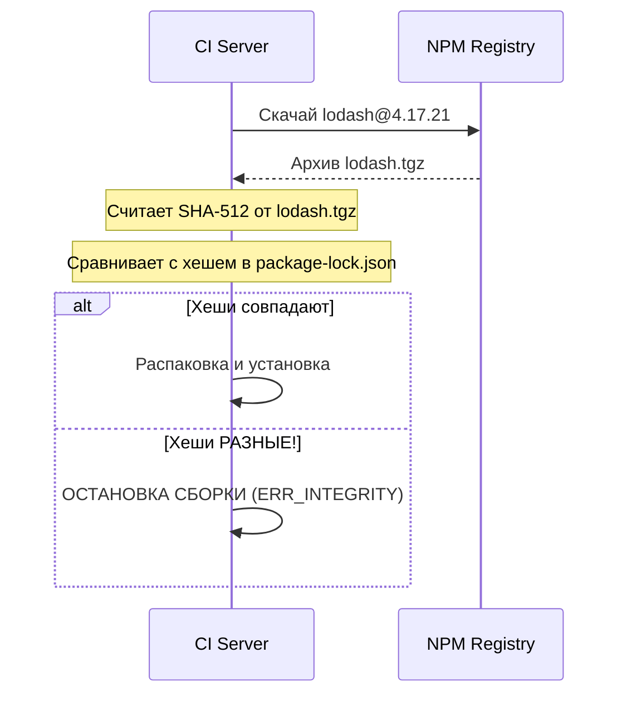

# Package Integrity (Целостность пакетов)

## Суть и решаемая боль
NPM (Node Package Manager) — это Дикий Запад. Любой может опубликовать туда код. Ваш проект тянет `react`, который тянет `lodash`, который тянет еще 50 зависимостей. Что если хакер взломает аккаунт автора маленькой библиотеки для форматирования дат, которой вы пользуетесь, и добавит туда код для кражи кредитных карт?
Боль: мы не контролируем код 99% нашего бандла. Атака через зависимости (Supply Chain Attack) — самый популярный способ взлома фронтенда.

**Package Integrity (Целостность)** — это механизмы и практики, гарантирующие, что скачанный нами пакет:
1. Это именно тот пакет, за который он себя выдает.
2. Его код не был изменен в полете (MitM) или подменен в регистре.

## Как это работает на практике

На фронтенде целостность проверяется криптографически через **Subresource Integrity (SRI)** в браузере и поле **integrity** в `package-lock.json` при установке.



## Примеры кода и настроек

**Антипаттерн (Установка без проверки целостности):**
```bash
# Игнорирование проверки хэшей (часто делают для ускорения или обхода багов прокси).
# Это открывает дверь для подмены пакетов.
npm install --no-audit --no-fund --legacy-peer-deps --no-shrinkwrap
```

**Правильное решение (Subresource Integrity для CDN):**
Если вы подключаете скрипты через CDN (например, виджет чата), ВСЕГДА используйте `integrity`.
```html
<!-- Если хакер взломает CDN cdnjs.com и подменит vue.js, браузер откажется его выполнять, 
потому что новый хэш файла не совпадет с указанным в атрибуте integrity. -->
<script 
  src="https://cdnjs.cloudflare.com/ajax/libs/vue/3.2.37/vue.global.min.js"
  integrity="sha512-Y3a2K1B9T2..."
  crossorigin="anonymous">
</script>
```

## Неочевидные нюансы и границы применимости
- **Typosquatting (Опечатки):** Целостность не спасет, если вы сами установили зловред. Если вы ошиблись и написали `npm install reacr` вместо `react`, NPM скачает этот пакет, сгенерирует для него хэш и заботливо положит в lockfile. Защита от этого — ручной аудит и сканеры типа Snyk.
- **Подмена в самом регистре:** Если хакер получит доступ к NPM и выпустит новую мажорную версию библиотеки `1.0.0` -> `2.0.0`, то при следующем `npm update` вы скачаете зловред, и NPM посчитает его легитимным, записав новый хэш в lockfile. Спасает только жесткое прибивание версий и отказ от автоматических апдейтов без ревью.
- **Движение в сторону Sigstore:** В новых версиях NPM появляется поддержка Sigstore — системы, которая позволяет криптографически доказать, что конкретная версия пакета была собрана из конкретного коммита на GitHub, и никто не подменил код между коммитом и публикацией.
