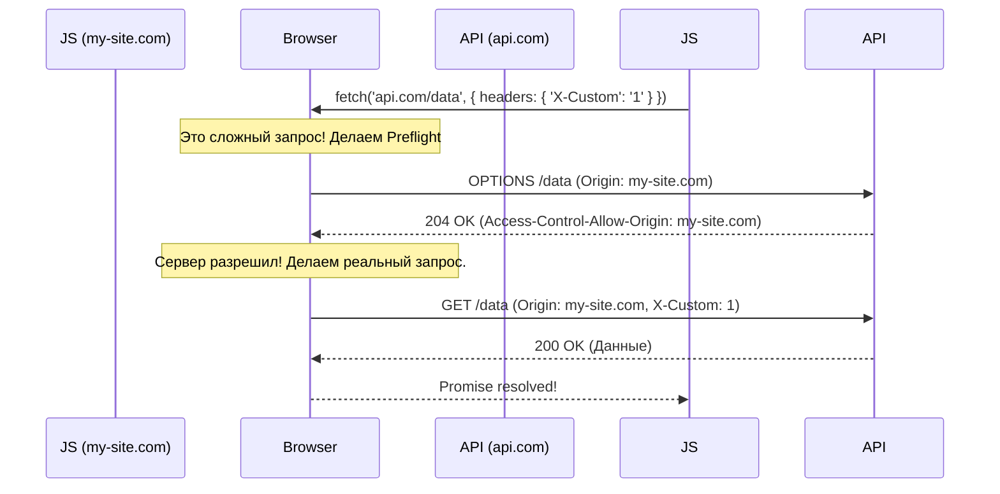

# CORS (Cross-Origin Resource Sharing)

## Суть и решаемая боль
По умолчанию браузеры невероятно параноидальны. Из-за механизма **Same-Origin Policy (SOP)** скрипт, загруженный на `https://my-site.com`, не имеет права читать данные с `https://api.hacker.com` или даже с `https://api.my-site.com` (разные поддомены = разные origin). 
Боль разработчиков: "Почему мой фронтенд на localhost:3000 не может сделать fetch к моему же бэкенду на localhost:8080? Я вижу ошибку 'Blocked by CORS'!".

**CORS** — это механизм, который позволяет серверу сказать браузеру: "Эй, я доверяю этому origin, позволь ему прочитать мой ответ". Это **ослабление** строгой политики безопасности SOP.

## Как это работает на практике

CORS — это исключительно диалог между **Браузером** и **Сервером** через HTTP-заголовки.

Если запрос "простой" (GET/POST без кастомных заголовков), браузер просто шлет его, но не показывает ответ JS-коду, пока не увидит правильный заголовок `Access-Control-Allow-Origin`.
Если запрос "сложный" (например, с `Content-Type: application/json` или `Authorization`), браузер сначала шлет предварительный `OPTIONS` запрос (Preflight).



## Примеры кода

**Антипаттерн (CORS Wildcard с куками):**
```javascript
// На сервере
res.setHeader('Access-Control-Allow-Origin', '*'); 
res.setHeader('Access-Control-Allow-Credentials', 'true');
// ОШИБКА: Браузер запрещает сочетать '*' (разрешить всем) и Credentials (разрешить куки).
// Это сделано специально, чтобы вы не отдали сессию пользователя всему интернету.
```

**Правильное решение (Динамический Origin на бэкенде):**
```javascript
// Сервер должен проверять Origin из заголовка запроса по белому списку
const allowedOrigins = ['https://my-site.com', 'http://localhost:3000'];

app.use(cors({
  origin: function(origin, callback) {
    if (!origin || allowedOrigins.includes(origin)) {
      callback(null, true);
    } else {
      callback(new Error('Not allowed by CORS'));
    }
  },
  credentials: true // Разрешает передачу куки и Authorization заголовков
}));
```

## Неочевидные нюансы и трейдоффы
- **CORS НЕ защищает бэкенд:** CORS — это защита **браузера**, а не сервера. Если злоумышленник напишет скрипт на Python (`requests.get(...)`) или использует Postman, он легко сделает запрос к вашему API, потому что в Postman нет браузерного движка, который блокирует CORS. CORS защищает пользователей от того, чтобы вредоносные сайты не читали их данные от вашего имени.
- **Proxy в разработке:** Самый частый способ обойти CORS при локальной разработке (когда фронт на 3000, а бэкенд на 8080) — настроить прокси в Webpack/Vite. Фронтенд делает запрос на `/api` (localhost:3000), а Vite-сервер перехватывает его и проксирует на `localhost:8080`. Браузер думает, что запрос ушел на тот же Origin, и SOP не срабатывает.
- **Оверхед Preflight:** `OPTIONS` запросы удваивают сетевой трафик (на каждый клик — два запроса). Чтобы этого избежать, бэкенд должен отправлять заголовок `Access-Control-Max-Age: 86400`. Браузер закэширует разрешение на сутки и не будет спамить `OPTIONS`.
