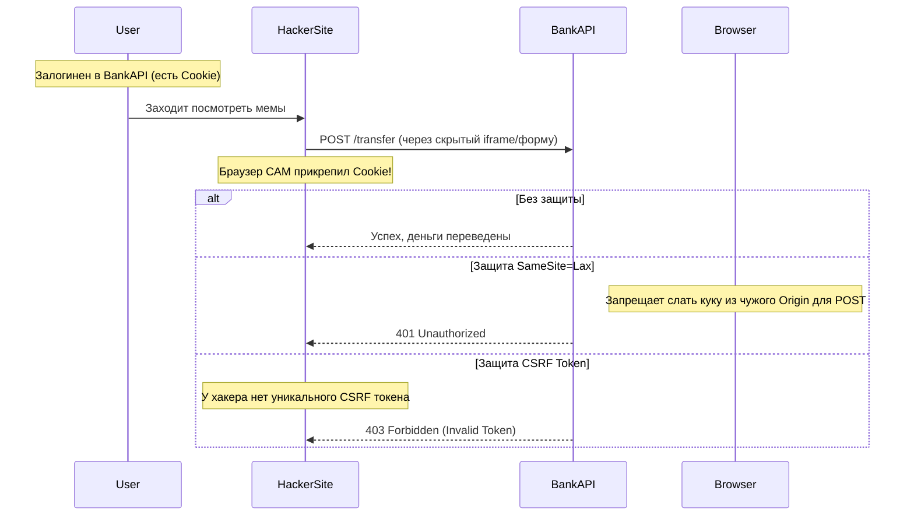

# CSRF (Cross-Site Request Forgery)

## Суть и решаемая боль
Представьте: вы залогинены в онлайн-банке (`bank.com`). Затем вы открываете в соседней вкладке мемный сайт (`hacker.com`). Хакер разместил там невидимую форму, которая автоматически отправляет POST-запрос на `bank.com/transfer` с параметрами "переведи $1000 хакеру". 
Так как вы залогинены в банке, **браузер автоматически прикрепит вашу сессионную куку** к этому запросу. Банк подумает, что это сделали вы. 
Боль: автоматическая отправка кук браузером позволяет другим сайтам подделывать действия от вашего имени.

**CSRF (Подделка межсайтовых запросов)** — это атака, использующая доверие сервера к браузеру пользователя.

## Как это работает на практике

Защита от CSRF на фронтенде сводится к двум вещам: использованию атрибута `SameSite` для кук и передаче специальных Anti-CSRF токенов.



## Примеры защиты

**Паттерн 1: SameSite Cookie (Современный стандарт):**
```javascript
// На стороне сервера при авторизации
res.cookie('session_id', '123', { 
  httpOnly: true, 
  secure: true, 
  sameSite: 'Lax' // ИЛИ 'Strict'. Запрещает браузеру отправлять куку, если POST-запрос инициирован с другого домена (hacker.com).
});
```

**Паттерн 2: Double Submit Cookie (Если нужен CORS):**
```javascript
// 1. Сервер выдает ДВЕ куки: одну HttpOnly (сессия), вторую обычную (csrf-token)
// 2. Фронтенд (JS) читает обычную куку и копирует ее значение в заголовок X-CSRF-Token

const api = axios.create();

// Интерцептор: читаем куку и суем в хедер
api.interceptors.request.use((config) => {
  const csrfToken = getCookie('csrf-token');
  if (csrfToken) {
    config.headers['X-CSRF-Token'] = csrfToken;
  }
  return config;
});

// 3. Сервер проверяет, что значение куки совпадает со значением в заголовке.
// Хакер с чужого сайта не сможет прочитать куку из-за SOP, поэтому не сможет скопировать её в заголовок.
```

## Неочевидные нюансы и границы применимости
- **JWT в LocalStorage не уязвим к CSRF:** Если вы храните токен в In-Memory или LocalStorage и вручную добавляете его в `Authorization: Bearer`, вы **не уязвимы** к CSRF. CSRF эксплуатирует только автоматическое прикрепление куки браузером.
- **SameSite=Lax не панацея:** Флаг `Lax` защищает от POST-запросов с чужих доменов. Но если в вашем приложении деньги можно перевести обычным `GET` запросом (например, ``), то `Lax` вас не спасет (он разрешает куки для GET навигации). **GET-запросы никогда не должны менять состояние системы!**
- **CORS не спасает от CSRF:** CORS блокирует **чтение ответа**, но он не блокирует **отправку запроса**. POST запрос от хакера дойдет до сервера, сервер спишет деньги, а CORS просто не покажет хакеру ответ `200 OK`. Но деньги уже списаны! Именно поэтому нужен CSRF Token.
