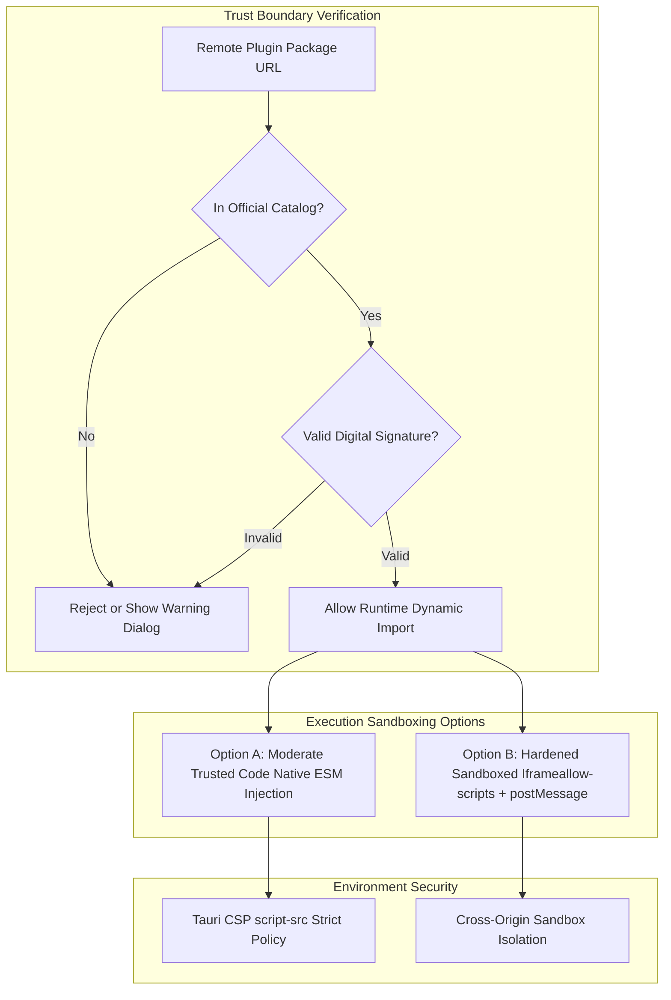

# Безопасность и изоляция динамических плагинов (Plugin Security & Sandboxing)

Переход к динамической загрузке JavaScript-кода плагинов по сетевым URL кардинально меняет вектор угроз веб- и десктоп-приложений. Любой загруженный скрипт стороннего разработчика исполняется в контексте браузера пользователя и потенциально имеет доступ к DOM, `localStorage`, токенам авторизации (`Bearer JWT`), кукам и API хост-системы.

В гибридных архитектурах (PWA + Tauri) компрометация одного плагина может привести к полной краже пользовательских данных или выполнению несанкционированных действий от имени пользователя.



## Стратегии защиты и архитектурные решения

### 1. Каталог плагинов и модерация (Catalog Moderation)

Самый надежный практический вариант для старта. Приложение не позволяет пользователю указывать произвольные HTTP-ссылки. В базе данных (`user_plugins`) хранится не произвольный URL, а строгий `plugin_id`.

Хост-сервер хранит предварительно проверенный и одобренный каталог плагинов (White-list Registry).

```typescript
// Backend (Elysia + Drizzle Schema)
export const userPlugins = sqliteTable('user_plugins', {
  userId: integer('user_id').notNull().references(() => users.id),
  pluginId: text('plugin_id').notNull(), // Хранится только одобренный ID
  settings: text('settings'),
  isEnabled: integer('is_enabled', { mode: 'boolean' }).default(true),
}, t => [primaryKey({ columns: [t.userId, t.pluginId] })]);
```

### 2. Песочница (Sandboxing via `<iframe>` or Worker)

Если требуется запустить неотмодерированный код стороннего автора, его изолируют внутрь `<iframe>` с ограниченным атрибутом `sandbox`:

```html
<!-- Изолированная песочница для исполнения неуправляемого кода -->
<iframe 
  src="https://sandbox.app.internal/plugin-runner.html"
  sandbox="allow-scripts"
  csp="default-src 'self'"
></iframe>
```

*Главный трейдоф:* Внутри `iframe` плагин теряет возможность напрямую отдавать Vue-компоненты для паттерна Extension Points. Все взаимодействие сводится к обмену сообщениями через `window.postMessage`, что резко усложняет построение богатого UI.

### 3. Согласие пользователя (Explicit User Consent)

При включении плагинов из внешних источников (Developer Mode) интерфейс обязан явно уведомить пользователя о рисках:

> ⚠️ **Предупреждение по безопасности:** Плагин из стороннего источника получает доступ к вашим данным и аккаунту. Устанавливайте плагин только в том случае, если полностью доверяете его автору.

### 4. Настройка Content Security Policy (Tauri CSP)

При использовании **Tauri** (для десктопа и мобильных платформ) встроенный движок WebView блокирует любую попытку загрузки скриптов с внешних доменов по умолчанию. В `tauri.conf.json` необходимо явно определить разрешенные доменные имена для `script-src` в разделе CSP:

```json
// tauri.conf.json
{
  "app": {
    "security": {
      "csp": "default-src 'self'; script-src 'self' 'wasm-unsafe-eval' https://plugins.insightbook.app https://cdn.jsdelivr.net;"
    }
  }
}
```

## Скрытые трейдоффы и границы применимости

1. **Компромисс между гибкостью и защищенностью:** Идеальная изоляция (`iframe` + `postMessage`) делает невозможным нативный рендеринг Vue 3 компонентов плагина в слотах хоста. Прямой `import()` ESM-модуля дает идеальный UX, но требует 100% доверия к коду плагина (через каталог и модерацию).
2. **Утечки через Global Scope:** Код плагина, исполняемый в основном потоке, может переопределить `window.fetch` или прочитать токены из `localStorage`. Если плагинам разрешен нативный `import()`, храните секретные токены только в `HttpOnly` куках или безопасном хранилище Tauri Store (`tauri-plugin-store`), недоступном для браузерного `localStorage`.
