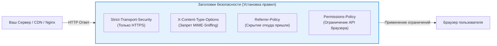

# Security Headers (HTTP Заголовки безопасности)

Security Headers — это набор HTTP-заголовков, которые сервер отправляет браузеру, чтобы жестко ограничить потенциально опасное поведение по умолчанию. Протоколы веба проектировались в эпоху доверия, и многие дефолтные механизмы (например, угадывание типов файлов или передача рефереров) сегодня являются зияющими дырами.

## 🛡️ Боль: Опасные дефолты браузера

Если сервер просто отдает HTML/JS без дополнительных инструкций, браузер начинает проявлять «излишнюю инициативность»:
- Пытается угадать тип файла (MIME Sniffing), из-за чего может выполнить картинку как JavaScript.
- Открывает сайт по незащищенному HTTP, если пользователь забыл ввести `https://`.
- Щедро делится полным URL (включая приватные токены в query-параметрах) со сторонними сайтами при переходе по ссылке.
- Разрешает любым скриптам обращаться к камере или микрофону.

### Архитектура защиты заголовками

Заголовки безопасности действуют как контракт между вашим сервером и браузером пользователя:



---

## 🛠 Ключевые заголовки и примеры (Как надо)

*(Заголовки Content-Security-Policy и X-Frame-Options подробно разобраны в их собственных разделах).*

### 1. HTTP Strict Transport Security (HSTS)
Запрещает браузеру даже пытаться открыть сайт по HTTP. Защищает от атак Man-in-the-Middle (Downgrade attack, SSL Stripping).
```http
# Браузер запомнит на 1 год (31536000 сек), что сюда можно ходить ТОЛЬКО по HTTPS, включая поддомены
Strict-Transport-Security: max-age=31536000; includeSubDomains; preload
```
> ⚠️ **Трейдофф:** Если вы включите HSTS на 1 год, а потом у вас отвалится SSL-сертификат, ваш сайт будет **полностью недоступен** для всех, кто заходил на него ранее. Браузер не даст нажать кнопку "Продолжить на свой страх и риск". Внедрять нужно аккуратно, начиная с `max-age=300` (5 минут).

### 2. X-Content-Type-Options
Запрещает браузеру анализировать содержимое файла и пытаться угадать его тип.
```http
X-Content-Type-Options: nosniff
```
**Боль:** Если пользователь загрузит на ваш сайт аватарку `image.jpg`, внутрь которой он зашил кусок JavaScript-кода, старый браузер мог «понюхать» (sniff) файл, решить что это код, и выполнить его (XSS). С `nosniff` браузер строго верит заголовку `Content-Type: image/jpeg` и отказывается выполнять его как скрипт.

### 3. Referrer-Policy
Управляет тем, сколько информации о текущем URL браузер передает в заголовке `Referer` при переходе по внешним ссылкам.
```http
# Безопасный дефолт: передавать только домен (не полный путь)
Referrer-Policy: strict-origin-when-cross-origin
```
**Боль:** Если пользователь находится на странице сброса пароля `yoursite.com/reset?token=123` и кликает на ссылку соцсети в футере, то без этого заголовка соцсеть получит токен в своих логах.

### 4. Permissions-Policy (ранее Feature-Policy)
Ограничивает доступ к мощным API браузера (камера, геолокация, микрофон, USB) для текущей страницы и встроенных iframe.
```http
# Запретить всем использовать камеру и микрофон, разрешить геолокацию только себе
Permissions-Policy: camera=(), microphone=(), geolocation=(self)
```

---

## ⚖️ Границы применимости и подводные камни

### Где конфигурировать?
Заголовки должны отдаваться **инфраструктурой**, а не кодом приложения. Идеальные места для их настройки: Nginx, Ingress Controller (Kubernetes), Cloudflare, AWS CloudFront или Vercel/Netlify config. Если вы настраиваете их на уровне Node.js (например, библиотекой `helmet` для Express), вы теряете защиту для статических файлов, которые часто отдаются сервером в обход Node.js.

### Оверхед на поддержку
Безопасность не бывает бесплатной. HSTS требует безупречного управления сертификатами. Слишком жесткая Permissions-Policy может сломать функционал оплаты (Apple/Google Pay в iframe), а Referrer-Policy может исказить маркетинговую аналитику. Любое внедрение строгих заголовков требует фазы мониторинга.
