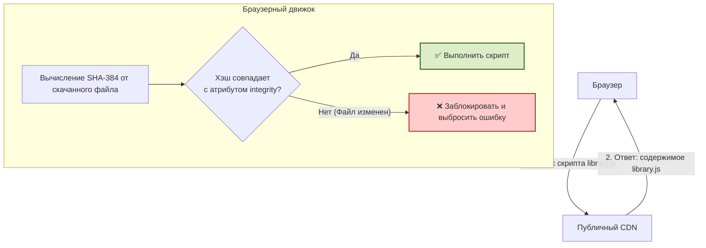

# Subresource Integrity (SRI)

Subresource Integrity (SRI) — это механизм безопасности браузера, гарантирующий, что ресурсы (скрипты, стили), загружаемые со сторонних серверов (обычно CDN), не были изменены или подменены злоумышленниками. 

## 📦 Боль: Атака на цепочку поставок (CDN Hijacking)

Современный фронтенд часто полагается на публичные CDN (Content Delivery Network) для загрузки популярных библиотек (React, Bootstrap, jQuery). Это экономит трафик и ускоряет загрузку благодаря кэшу.

Но что, если сервер CDN `unpkg.com` или `cdnjs.com` будет взломан? 
Злоумышленник может тихо добавить в оригинальный минифицированный файл `react.js` код криптомайнера или перехватчика паролей. В этот момент **миллионы сайтов по всему миру мгновенно становятся скомпрометированными**, хотя их собственные серверы никто не взламывал.

### Как работает защита SRI

SRI заставляет вас заранее задекларировать криптографический хэш (отпечаток) файла. Браузер скачивает файл, считает его хэш и сверяет с эталонным.



---

## 🛠 Как это выглядит в коде

Хэш генерируется заранее (через CLI или Webpack-плагины) и добавляется в атрибут `integrity`. Обязательно используется атрибут `crossorigin="anonymous"`, чтобы браузер не отправлял пользовательские куки на CDN и мог корректно прочитать файл для хэширования без проблем с CORS.

### ❌ Антипаттерн: Слепое доверие к CDN
```html
<!-- Опасно: Если CDN взломают, на вашем сайте выполнится любой код -->
<script src="https://cdn.example.com/library-v1.2.3.min.js"></script>
```

### ✅ Хорошая практика: Использование SRI
```html
<!-- Безопасно: Браузер выполнит код, ТОЛЬКО если он на 100% соответствует хэшу -->
<script 
  src="https://cdn.example.com/library-v1.2.3.min.js" 
  integrity="sha384-oqVuAfXRKap7fdgcCY5uykM6+R9GqQ8K/uxy9rx7HNQlGYl1kPzQho1wx4JwY8wC" 
  crossorigin="anonymous"
></script>
```

---

## ⚖️ Неочевидные нюансы и границы применимости

### 1. Автоматизация в CI/CD
Ручное вычисление хэшей (например, через `openssl dgst -sha384`) — это прямой путь к ошибкам и забытым обновлениям. В современных проектах SRI должен генерироваться автоматически на этапе сборки (например, плагином `webpack-subresource-integrity` или `vite-plugin-sri`).

### 2. Динамические скрипты и аналитика (Граница применимости)
Вы **не можете** использовать SRI для скриптов аналитики, виджетов или рекламы (Google Analytics, Яндекс.Метрика, Intercom). 
*Почему?* Провайдеры этих сервисов постоянно обновляют скрипты под капотом (добавляют фичи, фиксят баги), сохраняя один и тот же URL. Как только они обновят файл, его хэш изменится, и браузер заблокирует скрипт на вашем сайте. SRI применим **только к версионированным, иммутабельным файлам** (где версия жестко зашита в URL).

### 3. Отказ в обслуживании (Denial of Service)
SRI защищает от выполнения вредоносного кода, но создает риск Availability (доступности). Если вендор CDN случайно нарушит сборку (например, добавит пробел в конец файла при деплое), хэш не совпадет. Скрипт не выполнится, и ваше приложение сломается. 
**Трейдофф:** Мы выбираем «сломанное приложение» вместо «скомпрометированного приложения».

### 4. Влияние на производительность
Браузеру требуется время на вычисление SHA-256/384/512 хэша (особенно для огромных бандлов по несколько мегабайт на слабых мобильных устройствах). Выполнение скрипта блокируется до тех пор, пока хэш не будет полностью вычислен. На практике оверхед невелик, но о нем стоит помнить при оптимизации критического пути рендеринга.
