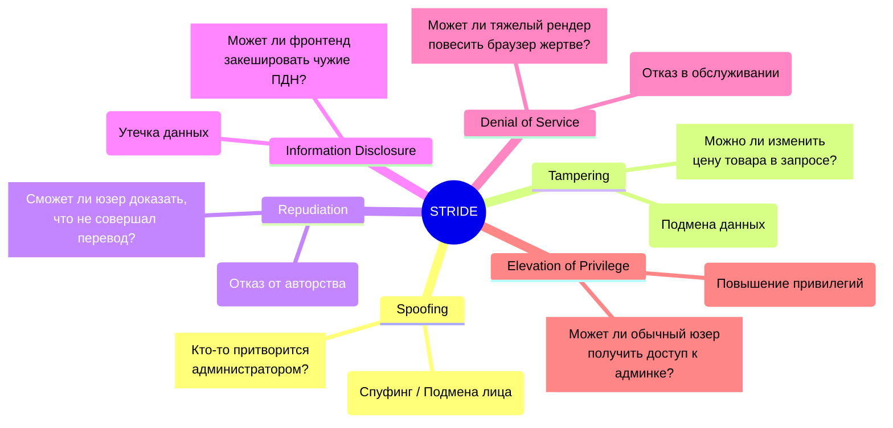

# Threat Modeling (Моделирование угроз)

Threat Modeling (Моделирование угроз) — это инженерный и аналитический процесс выявления, понимания и смягчения потенциальных угроз безопасности **до того, как будет написана первая строчка кода**. 

## 🧠 Боль: Безопасность как "пожаротушение"

В классическом подходе безопасность проверяется в самом конце: проект разработан, выкатывается на стейджинг, нанимаются пентестеры, они находят зияющие архитектурные дыры (например, токены передаются в URL, а бизнес-логика позволяет одному пользователю удалять проекты другого).
Исправление таких фундаментальных ошибок на этапе готового кода стоит колоссальных денег, срывает релизы и требует переписывания архитектуры.

Threat Modeling смещает фокус безопасности влево (Shift-Left) — на этап рисования архитектурных схем и обсуждения требований.

---

## 🔍 Как это работает: Методология STRIDE

Самый популярный фреймворк для моделирования угроз, разработанный в Microsoft — **STRIDE**. Это аббревиатура из 6 категорий угроз. Команда садится перед архитектурной диаграммой приложения и методично "прогоняет" каждый компонент через эти 6 вопросов.

### Пример из жизни Frontend-разработчика

Вы проектируете фичу: **Экспорт финансового отчета в PDF**.
Фронтенд отправляет запрос на бекенд, получает ссылку на S3 и скачивает файл.

Применяем STRIDE на этапе дизайна:
1. **Information Disclosure (Утечка):** Фронтенд получает ссылку вида `s3.com/report_123.pdf`. Что если юзер просто изменит 123 на 124? Получит ли он чужой отчет? (Insecure Direct Object Reference). *Решение:* Бекенд должен генерировать Signed URL (одноразовые ссылки).
2. **Tampering (Подмена):** Отчет формируется на основе JSON-параметров с фронтенда. Что если юзер подменит `companyId` в запросе на чужой? *Решение:* Бекенд должен брать `companyId` не из тела запроса, а строго из токена авторизации.

---

## 🛠 Практический процесс (4 шага)

1. **Что мы строим? (Модель системы):** Рисуем Data Flow Diagram (DFD). Показываем, где фронтенд, где API, где базы данных и как между ними движутся данные. Отмечаем "границы доверия" (Trust Boundaries) — например, переход от неконтролируемого браузера к нашему API.
2. **Что может пойти не так? (Поиск угроз):** Применяем STRIDE к каждому пересечению границы доверия.
3. **Что мы собираемся с этим делать? (Митигация):** Документируем решения. (Например: "Мы будем использовать HttpOnly куки для предотвращения кражи XSS", "Мы добавим Rate Limiting на кнопку отправки SMS").
4. **Хорошо ли мы поработали? (Валидация):** Покрывают ли наши тесты сценарии из шага 3?

---

## ⚖️ Трейдоффы и границы применимости

### 1. Паралич анализа (Analysis Paralysis)
Самая большая проблема Threat Modeling — команда может потратить недели на обсуждение невероятных сценариев (вроде перехвата трафика спецслужбами) для простого приложения по доставке пиццы.
**Решение:** Оценивайте угрозы прагматично. Если стоимость реализации защиты превышает потенциальный ущерб от взлома, бизнес должен просто **принять этот риск** (Risk Acceptance).

### 2. Оверхед для стартапов
Для MVP и стартапов на ранней стадии полновесный Threat Modeling — это излишество, тормозящее Time-to-Market. В таких случаях достаточно опираться на базовые индустриальные стандарты (OWASP Top 10) и здравый смысл, откладывая формальное моделирование до этапа масштабирования.

### 3. Эффект "Галочки"
Моделирование угроз теряет смысл, если это документ, который создали, положили в Confluence и забыли. Он должен жить: превращаться в Jira-таски, учитываться в Code Review и покрываться E2E тестами безопасности.
