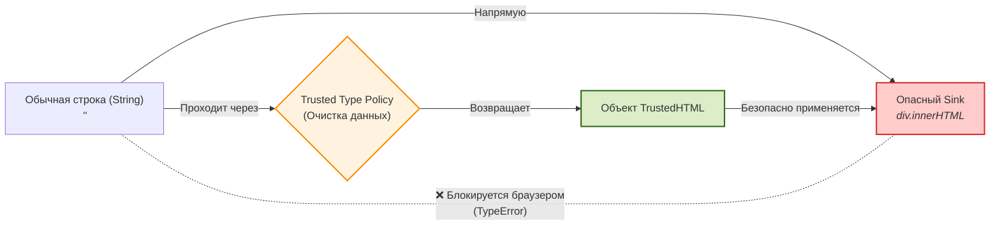

# Trusted Types

Trusted Types — это современный API безопасности браузера, созданный для тотального искоренения **DOM-based XSS** (Cross-Site Scripting на стороне клиента). 

## 🗡️ Боль: Небезопасные стоки (Dangerous Sinks)

Во фронтенд-приложениях XSS часто возникает не с бэкенда, а из-за того, что клиентский JavaScript берет данные из опасного источника (например, `location.hash` или параметры URL) и напрямую передает их в опасный приемник (Sink).

Классические опасные приемники:
- `element.innerHTML = ...`
- `document.write(...)`
- `eval(...)` / `setTimeout("...", 100)`

Если разработчик забудет экранировать данные перед вставкой, возникает уязвимость. Индустрия десятилетиями пыталась обучать разработчиков "не делать так" или использовать линтеры, но человеческий фактор побеждал.

### Идея Trusted Types: Защита на уровне типа данных

Вместо того чтобы надеяться на аккуратность программиста, Trusted Types **запрещает браузеру принимать обычные строки** в опасные стоки. Браузер начинает требовать специальный объект — `TrustedHTML`.



---

## 🛠 Как это работает на практике

Чтобы заставить эту магию работать, необходимо послать заголовок CSP (или мета-тег), включающий строгий режим:
```http
Content-Security-Policy: require-trusted-types-for 'script'; trusted-types my-policy;
```

### ❌ Антипаттерн (То, что теперь вызовет краш приложения)
Как только Trusted Types включены, любой код, пытающийся передать строку в `innerHTML`, упадет с ошибкой `TypeError`.
```javascript
// 🚨 БРАУЗЕР ВЫБРОСИТ ОШИБКУ:
// "Failed to set the 'innerHTML' property on 'Element': This document requires 'TrustedHTML' assignment."
document.getElementById('content').innerHTML = "<h1>Привет, " + userName + "</h1>";
```

### ✅ Правильный подход: Использование Политик
Вам необходимо создать "Политику" (Policy) — место, где строка официально очищается и превращается в доверенный тип. Идеально использовать для этого библиотеку **DOMPurify**.

```javascript
import DOMPurify from 'dompurify';

// 1. Создаем политику с именем 'my-policy' (должно совпадать с заголовком CSP)
const escapePolicy = trustedTypes.createPolicy('my-policy', {
  createHTML: (stringFromApp) => {
    // Вся логика санитизации здесь
    return DOMPurify.sanitize(stringFromApp, { RETURN_TRUSTED_TYPE: true });
  }
});

// 2. Использование в коде
const rawStr = "<h1>Привет, </h1>";

// policy.createHTML очищает строку и возвращает спец. объект TrustedHTML
const safeHtmlObj = escapePolicy.createHTML(rawStr); 

// 3. ✅ Успешно! Браузер видит тип TrustedHTML и разрешает вставку.
// Результат в DOM: <h1>Привет, </h1> (onerror вырезан)
document.getElementById('content').innerHTML = safeHtmlObj;
```

---

## ⚖️ Границы применимости и трейдоффы

### 1. Поддержка браузерами (Vendor Lock-in)
На данный момент Trusted Types полноценно поддерживаются **только в Chromium-браузерах** (Chrome, Edge). В Safari и Firefox поддержка либо экспериментальная, либо отсутствует. 
**Решение:** Обязательно использование полифилла (`trusted-types` npm package), чтобы приложение не падало в других браузерах (хотя защищать там оно будет только номинально).

### 2. Ад миграции Legacy-кода
Если вы включите `require-trusted-types-for 'script'` в старом проекте (особенно использующем jQuery), ваше приложение мгновенно умрет. Вы найдете сотни мест с `innerHTML`.
Миграция требует создания `default` политики (фоллбэк, который срабатывает автоматически для всех строк, идущих в sinks), но это сильно влияет на производительность, так как `DOMPurify` будет вызываться на каждое изменение DOM.

### 3. Современные фреймворки (React, Angular, Vue)
Если вы пишете на современном фреймворке, вы редко используете `innerHTML` напрямую. 
- **React** сам безопасно экранирует текст. А для `dangerouslySetInnerHTML` React требует явного осознания риска.
- **Angular** имеет встроенную поддержку Trusted Types из коробки.
Поэтому для современных стеков актуальность Trusted Types ниже, но это всё еще мощный предохранитель от "креативных" джуниор-разработчиков, решивших оптимизировать рендер через `ref.current.innerHTML`.
