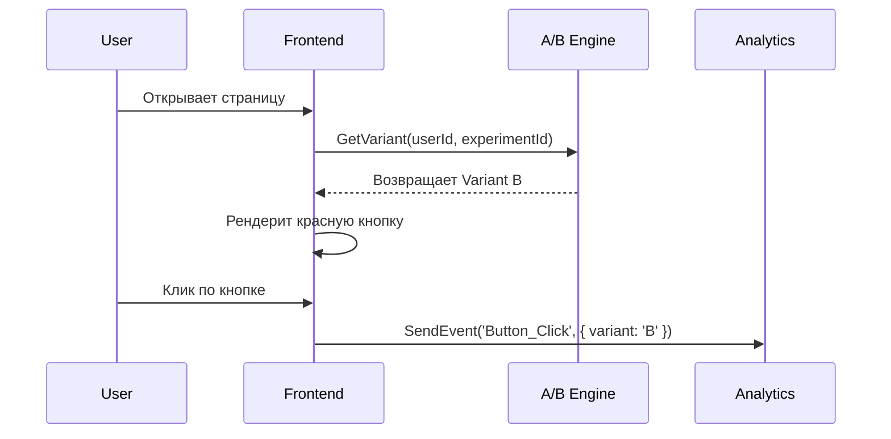

# A/B Testing (А/Б Тестирование)

## Суть концепции: Инженерия гипотез
А/Б тестирование — это контролируемый эксперимент, при котором трафик пользователей разделяется на две или более групп (A — контрольная, B — экспериментальная), чтобы проверить гипотезу о том, какая версия UI/UX или бизнес-логики работает лучше с точки зрения метрик. 
**Боль, которую мы решаем:** Отказ от "продуктовой интуиции" в пользу Data-Driven подхода. Мы перестаем спорить, какая кнопка конвертит лучше, и просто проверяем это на реальных пользователях, минимизируя риск выкатки неудачных фичей на всю аудиторию.

## Как это работает под капотом

Система A/B тестирования состоит из механизма сплитования (распределения пользователей) и системы сбора аналитики. Сплитование должно быть детерминированным (один и тот же пользователь всегда видит один и тот же вариант).



## Примеры кода: Как писать правильно

**Антипаттерн:** Хардкод логики сплитования прямо в компоненте на основе Math.random(). Это ломает консистентность (при рефреше вариант изменится) и не позволяет управлять тестом удаленно.

```typescript
// ❌ АНТИПАТТЕРН: Локальный рандом, никакой аналитики
const CheckoutButton = () => {
  const isVariantB = Math.random() > 0.5;
  return <button color={isVariantB ? 'red' : 'blue'}>Buy</button>;
};
```

**Правильное решение:** Использование провайдера экспериментов, детерминированного хэширования по ID пользователя и интеграция с аналитикой.

```typescript
// ✅ ПРАВИЛЬНО: Детерминированное получение варианта и трекинг
import { useExperiment, trackEvent } from '@/lib/ab-testing';

const CheckoutButton = ({ userId }) => {
  // Хук возвращает 'control' или 'treatment' на основе стейта из Remote Config
  const variant = useExperiment('new_checkout_button', userId);

  const handleClick = () => {
    trackEvent('checkout_clicked', { experiment_variant: variant });
    // ...
  };

  return (
    <button 
      className={variant === 'treatment' ? 'bg-red-500' : 'bg-blue-500'}
      onClick={handleClick}
    >
      Buy Now
    </button>
  );
};
```

## Неочевидные нюансы и границы применимости
- **Flickering (Мерцание UI):** Если вариант теста запрашивается асинхронно с клиента, пользователь сначала увидит дефолтный вариант (Control), а потом он "моргнет" на новый (Treatment). Решение: SSR-сплитование, Edge Workers (Cloudflare Workers, Vercel Edge) или кэширование на клиенте до рендера.
- **Размер выборки и статистическая значимость:** Нельзя заканчивать тест, как только B стал лучше A на пару процентов. Необходимо дождаться статистической значимости, иначе это будет ложноположительный результат.
- **Грязные данные:** Боты, пользователи с AdBlock или очищенными куками могут испортить результаты. Обязательна склейка сессий (Identity Resolution).
