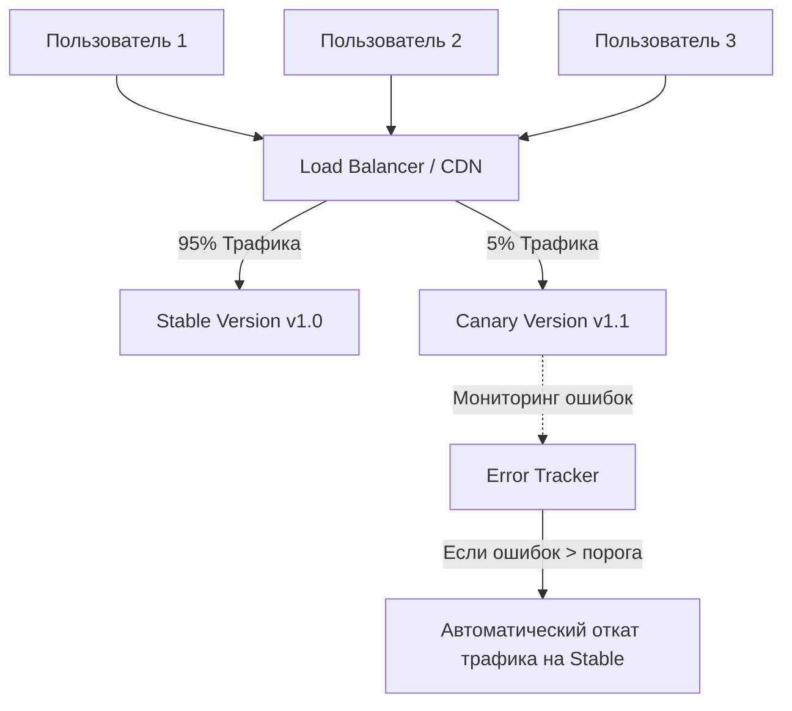

# Canary Releases (Канареечные релизы)

## Что это и какую боль мы решаем?
Название пошло от шахтеров, которые брали канарейку в шахту: если птичка замолкала, значит пошел токсичный газ и нужно спасаться. В разработке **Canary Release** — это техника деплоя, при которой новая версия приложения раскатывается не на всех пользователей сразу, а на малую долю (например, 1-5%). 
**Боль:** Мы боимся сломать production фатальным багом. Если выкатить релиз на 100% и там окажется утечка памяти или падение на старте, пострадает весь бизнес. Канарейка позволяет "пощупать" реальный прод-трафик, собрать метрики ошибок и перфоманса, и при малейших проблемах моментально откатить изменения для этой небольшой группы.

## Как это работает

Для фронтенда канарейка обычно реализуется на уровне CDN, Ingress-контроллера (в Kubernetes) или через Feature Flags, если речь идет об отдельной фиче, а не о всем бандле.



## Примеры реализации

В мире SPA фронтенда канарейки чаще всего делаются через маршрутизацию к разным `index.html`, которые ссылаются на разные хэши бандлов.

**Антипаттерн:** Выкатывать фронтенд без обратной совместимости API. Если "канареечный" фронтенд делает запрос к новому эндпоинту, а бэкенд еще не выкачен (или откатился) — канарейка упадет.

**Правильное решение:** Управление трафиком на уровне Nginx/CDN.

Пример конфига Nginx для канареечного сплитования по куке:
```nginx
# В зависимости от куки 'version' отдаем разные index.html
map $cookie_version $frontend_version {
    default     "stable";
    "canary"    "canary";
}

server {
    location / {
        root /var/www/frontend/$frontend_version;
        try_files $uri /index.html;
    }
}
```

## Неочевидные нюансы: трейдоффы и границы применимости
- **Проблема кэширования:** Фронтенд агрессивно кэшируется в браузерах. Пользователь может скачать `index.html` канарейки, а потом канарейку откатят, но у пользователя в Service Worker-е или кэше останется сломанная версия. Необходимо строго настраивать `Cache-Control: no-cache` для входной точки.
- **State Management & LocalStorage:** Если в канареечной версии вы поменяли структуру данных в `localStorage` или IndexedDB, а затем откатили пользователя на стабильную версию, старое приложение упадет при попытке прочитать новые данные. Нужны механизмы миграции и отката стейта.
- **Мониторинг — обязательное условие:** Делать канарейку без настроенного алертинга бессмысленно. Система должна сама "понять", что канарейка болеет (вырос rate 5xx или JS ошибок), и автоматически переключить роутер на stable.
