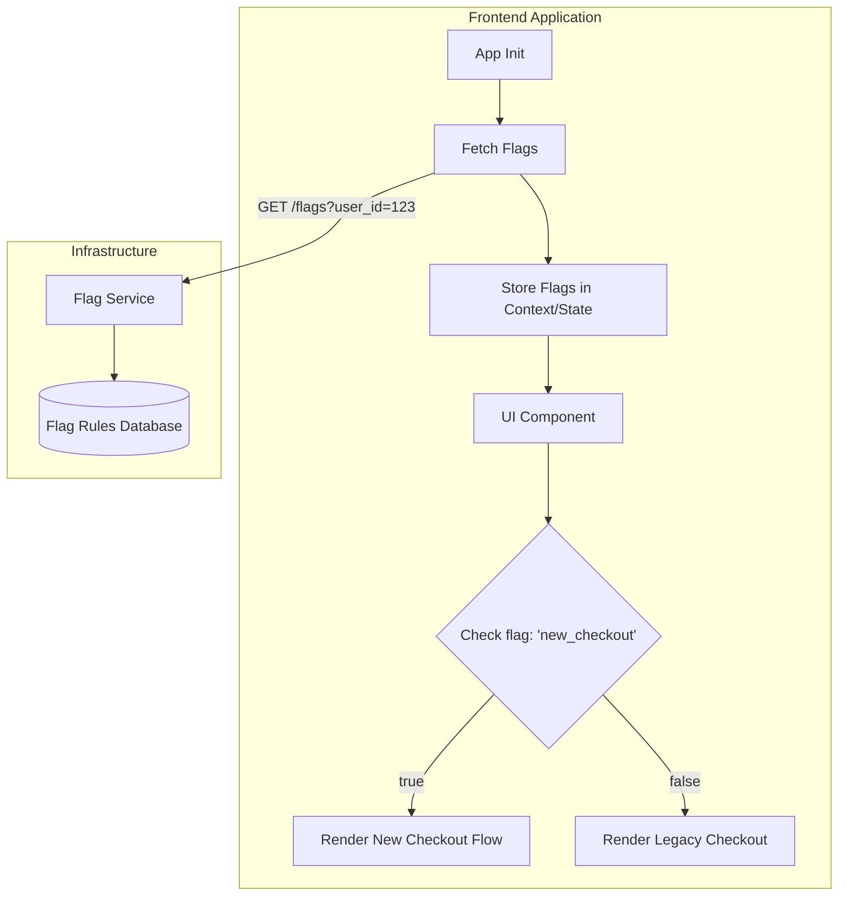

# Feature Flags (Флаги фичей)

## Суть концепции

В классическом цикле разработки релиз фичи неразрывно связан с её деплоем: как только код попадает на продакшен-сервер, пользователи сразу видят изменения. **Feature Flags (или Feature Toggles)** — это инженерный паттерн, который разрубает эту жесткую связь. Мы получаем возможность деплоить неактивный код, а включать его для пользователей позже, без дополнительных релизов и даунсекунд.

С точки зрения инженерии, фича-флаг — это ветвление в коде, которое управляется извне в реальном времени.

## Какую боль мы решаем?

1. **Страх большого релиза (Big Bang Release).** Когда релиз содержит десятки фичей за месяц, вероятность поломки колоссальна. Флаги позволяют раскатывать фичи по одной, проверяя стабильность.
2. **Долгие feature-ветки (Merge Hell).** Разработчикам больше не нужно держать ветку неделями, ожидая конца тестирования. Код интегрируется в `main` сразу, но прячется за флагом.
3. **Медленный откат (Rollback).** Если новая функциональность ломает продакшен, хотфикс и редеплой могут занять от 15 минут до нескольких часов. Выключение фича-флага занимает секунду.
4. **Канареечные релизы (Canary Releases) и A/B-тесты.** Невозможно проверить гипотезу на 5% пользователей без механизма динамического роутинга фичей.

## Как это работает на практике

Архитектура фича-флагов обычно состоит из провайдера конфигурации (например, LaunchDarkly, ConfigCat или самописного бэкенда), который отдает актуальное состояние флагов клиенту. На фронтенде мы оборачиваем наш код в проверку этих флагов.



### Примеры кода

**Антипаттерн: Глобальные переменные и размазывание проверок**
Жесткая привязка к глобальному объекту и дублирование логики (Spaghetti Code).

```typescript
// Плохо: Прямое обращение к window и хардкод
function CheckoutButton() {
  if (window.FEATURE_FLAGS.new_checkout_flow === true) {
    return <NewButton onClick={handleNew} />
  }
  return <OldButton onClick={handleOld} />
}
```

**Паттерн: Провайдер, Хуки и HOC (React)**
Инкапсуляция логики флагов через контекст. Мы делаем компоненты глупыми по отношению к тому, откуда берутся флаги.

```typescript
// Хорошо: Использование контекста и хука
import { useFeature } from '@core/feature-flags';

function CheckoutPage() {
  const isNewCheckoutEnabled = useFeature('new_checkout_flow');

  return isNewCheckoutEnabled ? <NewCheckout /> : <LegacyCheckout />;
}

// Альтернатива: Декларативный компонент (удобно для крупных блоков)
<FeatureFlag name="new_checkout_flow" fallback={<LegacyCheckout />}>
  <NewCheckout />
</FeatureFlag>
```

## Неочевидные нюансы и трейдоффы

1. **Технический долг и "Мертвое ветвление".** Флаги имеют свойство жить вечно, если их не удалять. Это приводит к разрастанию кодовой базы, где 30% кода — это мертвые ветки. 
   * **Решение:** Флаг должен иметь дату протухания (expiration date). Как только фича раскатана на 100%, заводится технический тикет на удаление флага и старого кода.
2. **Экспоненциальная сложность тестирования.** Если у вас 5 активных флагов, это $2^5 = 32$ состояния системы. Протестировать все невозможно. 
   * **Границы применимости:** Избегайте зависимых флагов (флаг B работает только если включен флаг A). Тестируйте только два состояния: production (все новые флаги выключены) и release candidate (текущий тестируемый флаг включен).
3. **Мерцание интерфейса (FOUC).** При загрузке SPA флаги тянутся асинхронно с сервера. Если не обработать состояние "загрузки", пользователь увидит старый интерфейс, который через полсекунды моргнет и сменится на новый.
   * **Решение:** SSR с инжектом флагов в HTML (например, через глобальный объект при рендере страницы) или блокирующий loader на критичных маршрутах.
4. **Размер бандла.** Если вы прячете за флагом тяжелую библиотеку (например, 3D-рендер), она все равно попадет в бандл к пользователю, у которого флаг выключен. В таких случаях флаги необходимо комбинировать с **Code Splitting** (динамическими импортами `React.lazy`).
