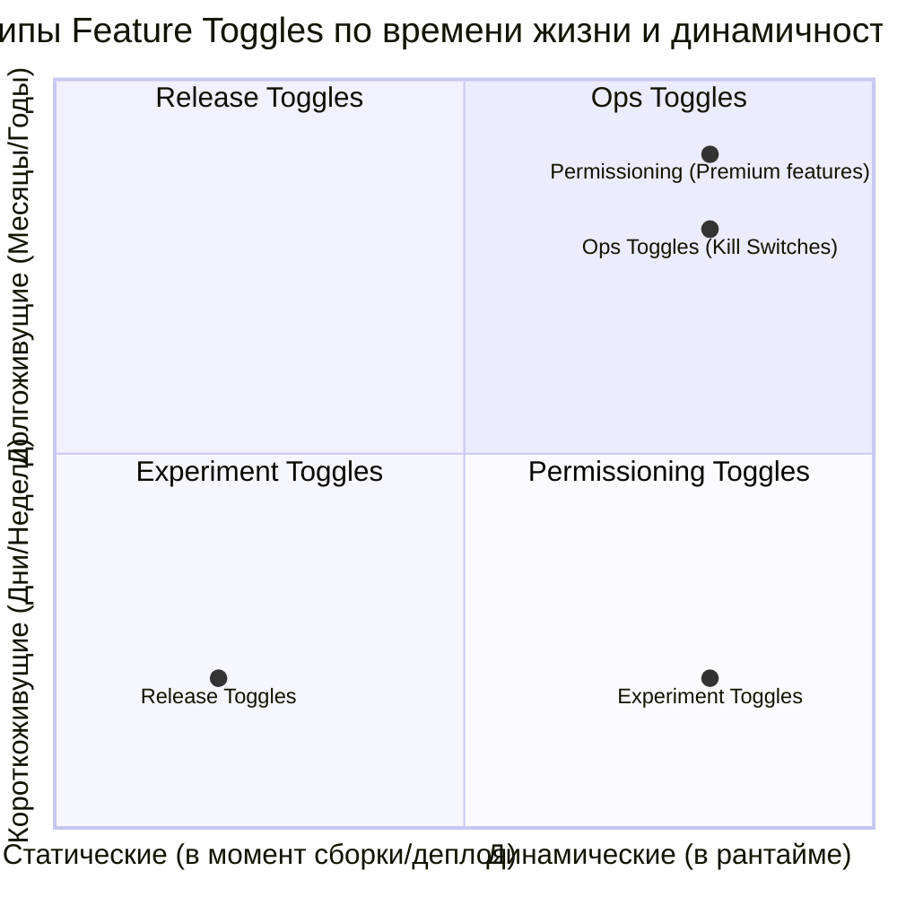

# Feature Toggle Patterns (Паттерны Фича-Флагов)

## Суть концепции
Фича-флаги (Feature Toggles) — это мощный инструмент, но если их использовать бездумно, код быстро превращается в "лапшу" из `if-else`, а старые флаги накапливаются как технический долг. В зависимости от задачи, флаги имеют разный жизненный цикл и архитектуру.

Пит Ходжсон (Pete Hodgson) из Martin Fowler's blog выделил классификацию флагов, чтобы инженеры понимали: **какие флаги когда удалять, и как они должны быть спроектированы.**

## Категории фича-флагов



1. **Release Toggles (Релизные флаги):** Позволяют мержить незаконченный код в `main`. Живут недолго (до релиза фичи). Часто статичны.
2. **Experiment Toggles (A/B тесты):** Динамичны, зависят от пользователя. Живут пару недель, пока идет эксперимент.
3. **Ops Toggles (Kill Switches):** Операционные флаги для экстренного отключения "тяжелых" или сломанных частей (например, чат-виджета под DDoS). Живут долго, переключаются в рантайме.
4. **Permissioning Toggles:** Открывают фичи для определенных пользователей (бета-тестеры, premium-подписка). Долгоживущие.

## Примеры кода: Инкапсуляция логики флагов

**Антипаттерн:** Размывание логики флагов по всем компонентам. Когда флаг нужно удалить, придется переписывать половину приложения.

```typescript
// ❌ АНТИПАТТЕРН: Флаг "протёк" в бизнес-логику и UI
const ShoppingCart = () => {
  const isNewCartEnabled = useFeatureFlag('new-cart-v2');
  
  return (
    <div>
      {isNewCartEnabled ? <CartV2 /> : <CartV1 />}
    </div>
  );
};
```

**Правильное решение:** Использование паттерна "Toggle Router" на уровне конфигурации роутинга или Dependency Injection, чтобы сам компонент ничего не знал о флаге.

```typescript
// ✅ ПРАВИЛЬНО: Вынос логики на уровень роутинга или HOC
const CartRoute = () => {
  // Компонент-обертка инкапсулирует логику флага
  return (
    <FeatureFlagGuard 
      flag="new-cart-v2" 
      onEnabled={<CartV2 />} 
      onDisabled={<CartV1 />} 
    />
  );
};
```

## Неочевидные нюансы и границы применимости
- **"Кладбище флагов":** Самая частая проблема — забытые Release Toggles. Через год в коде лежат два варианта логики, один из которых никто не тестирует. Практика: при создании флага сразу создавайте тикет в Jira на его удаление с дедлайном.
- **Тестирование стейта:** Если у вас 10 активных флагов, то у приложения $2^{10} = 1024$ состояния. Протестировать все невозможно. Старайтесь делать флаги независимыми друг от друга и избегать их вложенности (флаг внутри флага).
- **TypeScript:** Флаги усложняют типизацию. Если фича включена, объект может иметь новые поля, если выключена — нет. Приходится писать защитные проверки типов (Type Guards).
