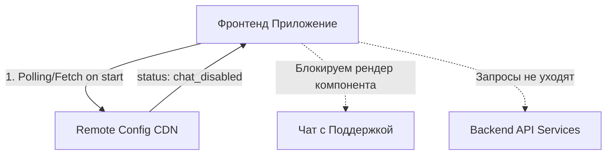

# Kill Switch (Аварийный рубильник)

## Что это и какую боль мы решаем?
Kill Switch — это частный случай долгоживущего Feature Toggle (Ops Toggle), предназначенный для мгновенного отключения подсистемы в случае инцидента. 
**Боль:** Фронтенд обращается к бэкенду. Бэкенд ложится от нагрузки (DDoS или баг в базе). Если фронтенд продолжит слать ретраи или рисовать UI, который триггерит запросы, бэкенд никогда не поднимется (возникнет эффект Thundering Herd). Kill Switch позволяет "отрубить" фичу прямо на клиенте, не дожидаясь редеплоя, тем самым снизив нагрузку и красиво показав пользователю заглушку.

## Как это работает

Конфиг с Kill Switches должен раздаваться максимально надежно (например, лежать статикой на CDN), чтобы даже в случае глобального сбоя фронтенд мог получить актуальный статус.



## Примеры реализации

**Антипаттерн:** Полагаться на то, что если бэкенд возвращает 503 Service Unavailable, мы просто покажем ошибку. В этом случае запросы всё равно летят, тратя ресурсы сети и ингресса.

**Правильное решение:** Проверять Kill Switch перед рендером тяжелого компонента или инициализацией модуля.

```typescript
// ✅ ПРАВИЛЬНО: Инкапсуляция логики Kill Switch с Graceful Degradation
import { useConfig } from '@/lib/remote-config';

const SupportChatFeature = () => {
  const isChatDisabled = useConfig('kill_switch_support_chat');

  if (isChatDisabled) {
    return (
      <div className="alert-box">
        Извините, чат временно недоступен. Напишите нам на почту support@example.com
      </div>
    );
  }

  return <LiveChatWidget />;
};
```

## Неочевидные нюансы и границы применимости
- **Время жизни (TTL) конфига:** Если вы кешируете Remote Config в браузере на 1 час, то нажатие Kill Switch подействует на пользователей только через час! Конфигурация рубильников должна иметь минимальный Cache-Control или доставляться через Server-Sent Events / WebSockets для мгновенной реакции.
- **Оверхед на поллинг:** Если 10 миллионов клиентов начнут опрашивать конфиг каждую секунду, они положат CDN. Обязателен jitter (рандомизация интервала) и экспоненциальный бэкофф.
- **Что отключать?** Внедрять Kill Switch нужно не везде, а только в ресурсоемких некритичных подсистемах (рекомендации, чат, тяжелая аналитика). Корзина покупок не должна иметь Kill Switch — если она сломалась, мы и так потеряли деньги, рубильник тут не поможет.
